# Jour 1 — Job 01 : Welcome to Docker (Part 1) — Pull and Run

> Formation développeur web — **La Plateforme**
> Objectif : découvrir Docker, récupérer une image depuis le Docker Hub,
> lancer un conteneur, y accéder depuis le navigateur, puis nettoyer.

Image de travail : **[docker/welcome-to-docker](https://github.com/docker/welcome-to-docker)**

---

## Sommaire

1. [Environnement de travail](#1-environnement-de-travail)
2. [Installation et vérification de Docker](#2-installation-et-vérification-de-docker)
3. [Le compte Docker Hub](#3-le-compte-docker-hub)
4. [Les commandes de base](#4-les-commandes-de-base)
5. [Récupérer l'image (`docker pull`)](#5-récupérer-limage-docker-pull)
6. [Lancer le conteneur (`docker run`)](#6-lancer-le-conteneur-docker-run)
7. [Accéder au conteneur depuis le navigateur](#7-accéder-au-conteneur-depuis-le-navigateur)
8. [Arrêter le conteneur (`docker stop`)](#8-arrêter-le-conteneur-docker-stop)
9. [Supprimer le conteneur (`docker rm`)](#9-supprimer-le-conteneur-docker-rm)
10. [Supprimer l'image (`docker rmi`)](#10-supprimer-limage-docker-rmi)
11. [Mémo des commandes de suppression](#11-mémo-des-commandes-de-suppression)
12. [L'erreur présente dans les commandes du sujet](#12-lerreur-présente-dans-les-commandes-du-sujet)
13. [Récapitulatif du cycle de vie](#13-récapitulatif-du-cycle-de-vie)
14. [Ce que j'ai retenu](#14-ce-que-jai-retenu)

---

## 1. Environnement de travail

| Élément | Valeur |
|---|---|
| Système d'exploitation | Windows 11 Pro (build 26100) |
| Terminal utilisé | PowerShell |
| Version de Docker | `29.2.1`, build `a5c7197` |
| Contexte Docker | `desktop-linux` (moteur Linux via WSL 2) |
| Port hôte choisi | `8088` (le port `80` est occupé par Laragon, le `8080` par un autre projet) |

---

## 2. Installation et vérification de Docker

### 2.1 — Vérifier que Docker est installé

La toute première commande à connaître : elle interroge **le client Docker**
(le programme en ligne de commande) et affiche sa version.

```powershell
docker --version
```

```
Docker version 29.2.1, build a5c7197
```

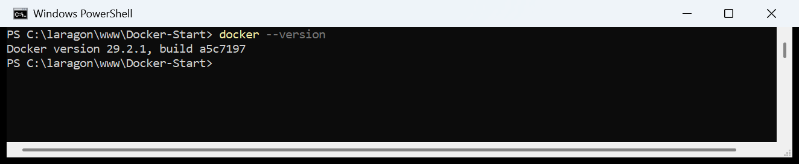

> **Ce que ça prouve :** le CLI Docker est installé et présent dans le `PATH` de
> Windows. Attention, ça ne prouve **pas** que Docker est capable de faire
> tourner un conteneur — voir juste en dessous.

---

### 2.2 — Première erreur rencontrée : le daemon n'est pas démarré

J'ai enchaîné avec `docker info` et je suis tombé sur une erreur :

```powershell
docker info
```

```
Client:
 Version:    29.2.1
 Context:    desktop-linux
 ...

Server:
failed to connect to the docker API at npipe:////./pipe/dockerDesktopLinuxEngine;
check if the path is correct and if the daemon is running:
open //./pipe/dockerDesktopLinuxEngine: Le fichier spécifié est introuvable.
```

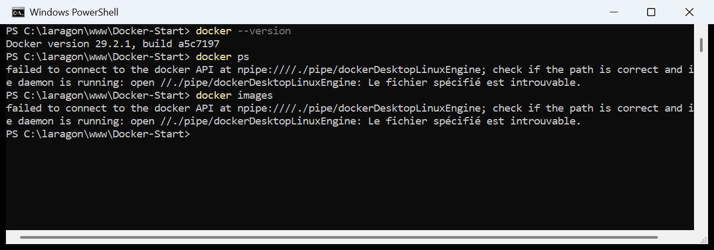

> **Analyse de l'erreur — et c'est LA notion clé du job :**
> Docker est composé de **deux parties distinctes** :
>
> | Partie | Rôle | État à ce moment-là |
> |---|---|---|
> | **Le client** (`docker` en ligne de commande) | Envoie les ordres | ✅ Fonctionne |
> | **Le daemon / moteur** (`dockerd`) | Exécute réellement les conteneurs | ❌ Éteint |
>
> Le bloc `Client:` s'affiche correctement, mais le bloc `Server:` renvoie une
> erreur de connexion : le client n'arrive pas à joindre le moteur via le
> *named pipe* Windows.
>
> **Toutes** les commandes qui ont besoin du moteur échouaient de la même façon :
> `docker ps`, `docker images`, `docker pull`, `docker run`…
> Seules `docker --version` et `docker <commande> --help` continuaient de
> répondre, car elles sont purement côté client.

**Correction :** lancer **Docker Desktop** (qui démarre le daemon), puis attendre
que l'icône de la baleine passe au vert dans la barre des tâches.

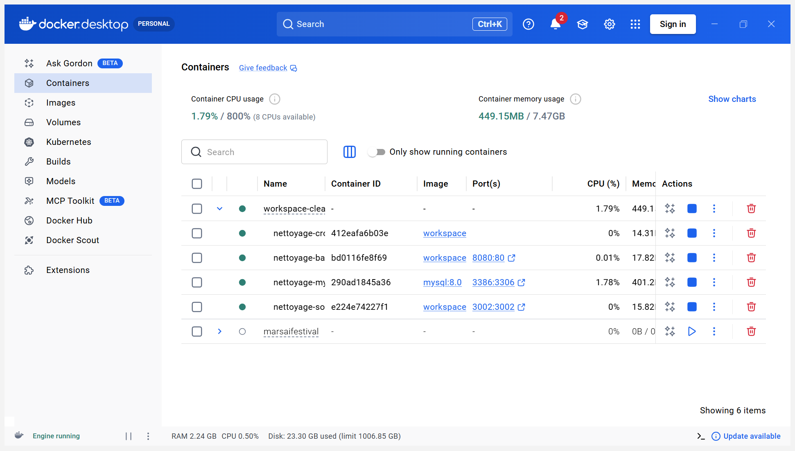

---

### 2.3 — `docker info` une fois le moteur démarré

```powershell
docker info
```

```
Server:
 Containers: 8
  Running: 4
  Paused: 0
  Stopped: 4
 Images: 10
 Server Version: 29.2.1
 Storage Driver: overlayfs
 Logging Driver: json-file
 Cgroup Driver: cgroupfs
 Cgroup Version: 2
```

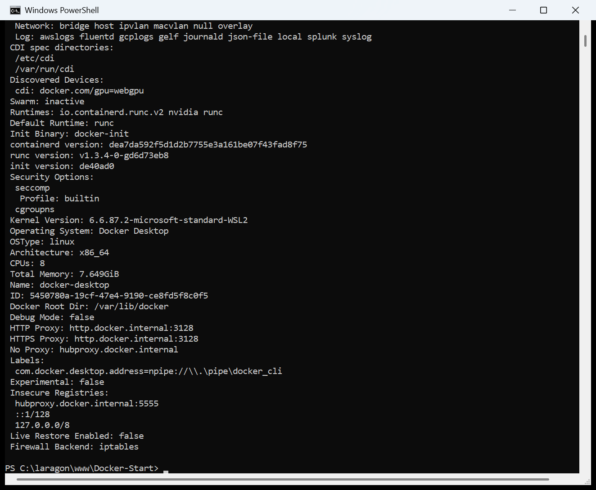

> **Lecture du résultat :** le bloc `Server:` s'affiche enfin. Il donne un état
> global du moteur : 8 conteneurs connus (4 en cours d'exécution, 4 arrêtés) et
> 10 images stockées localement — ce sont mes projets précédents, je n'y touche pas.
> `Storage Driver` indique comment Docker empile les couches d'images sur le disque.

---

## 3. Le compte Docker Hub

Le **Docker Hub** ([hub.docker.com](https://hub.docker.com/)) est le registre
public d'images officiel de Docker. C'est là que `docker pull` va chercher les
images par défaut.

```powershell
docker login
```


> **À retenir :** se connecter n'est **pas obligatoire** pour télécharger une
> image **publique** comme `docker/welcome-to-docker`. Je l'ai d'ailleurs
> récupérée sans être authentifié (voir l'étape 5).
>
> La connexion devient nécessaire pour :
> - `docker push` (publier sa propre image) ;
> - télécharger une image **privée** ;
> - dépasser la limite de téléchargements anonymes imposée par le Hub.
>
> Pour vérifier si on est connecté : `docker info` affiche une ligne
> `Username:` quand une session est active. Pour se déconnecter : `docker logout`.

---

## 4. Les commandes de base

### 4.1 — `docker ps` : lister les conteneurs **en cours d'exécution**

```powershell
docker ps
```

```
CONTAINER ID   IMAGE                           COMMAND                  CREATED       STATUS                    PORTS                            NAMES
412eafa6b03e   workspace-cleanmaster-cron      "docker-php-entrypoi…"   7 weeks ago   Up 42 seconds                                              nettoyage-cron
bd0116fe8f69   workspace-cleanmaster-backend   "/usr/local/bin/entr…"   8 weeks ago   Up 42 seconds             0.0.0.0:8080->80/tcp             nettoyage-backend
290ad1845a36   mysql:8.0                       "docker-entrypoint.s…"   8 weeks ago   Up 42 seconds (healthy)   127.0.0.1:3386->3306/tcp         nettoyage-mysql
e224e74227f1   workspace-cleanmaster-socket    "docker-entrypoint.s…"   8 weeks ago   Up 42 seconds             0.0.0.0:3002->3002/tcp           nettoyage-socket
```

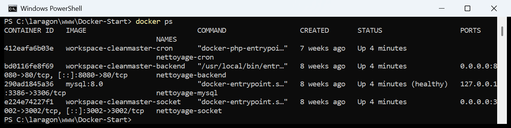

> **Lecture des colonnes :**
> - `CONTAINER ID` — identifiant court et unique du conteneur ;
> - `IMAGE` — l'image à partir de laquelle il a été créé ;
> - `STATUS` — `Up ...` = en marche, `Exited (0) ...` = arrêté proprement ;
> - `PORTS` — la redirection `hôte -> conteneur`. `0.0.0.0:8080->80/tcp` signifie
>   « le port 8080 de ma machine est branché sur le port 80 du conteneur » ;
> - `NAMES` — le nom lisible (auto-généré si on ne le précise pas).
>
> **Variante indispensable :** `docker ps -a` (ou `--all`) affiche **aussi** les
> conteneurs arrêtés. `docker ps` seul ne montre que ceux qui tournent — c'est
> le piège classique quand on croit qu'un conteneur a disparu.

---

### 4.2 — `docker images` : lister les images stockées localement

```powershell
docker images
```

```
IMAGE                                  ID             DISK USAGE   CONTENT SIZE
busybox:latest                         fd8d9aa63ba2       6.81MB         2.23MB
grafana/grafana:latest                 a03d9e604e4d       1.45GB          347MB
marsaifestival-backend:latest          374e8c7b0659        828MB          159MB
marsaifestival-frontend:latest         825feeeb1ce5        669MB          155MB
mysql:8.0                              64756cc92f70       1.08GB          247MB
nginx:alpine                           8aa63af009a3       93.5MB         26.9MB
phpmyadmin/phpmyadmin:latest           42a200db07b4       1.09GB          221MB
workspace-cleanmaster-backend:latest   3ab197469ba3        723MB          180MB
workspace-cleanmaster-cron:latest      5e61c12f4219        199MB         48.2MB
workspace-cleanmaster-socket:latest    a9ab8df05231        227MB           54MB
```

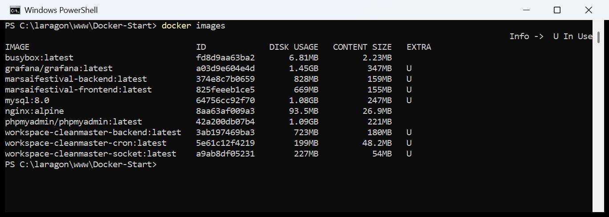

> **Image ≠ conteneur.** C'est la distinction fondamentale :
>
> | | Image | Conteneur |
> |---|---|---|
> | Nature | Modèle figé, en lecture seule | Instance vivante de l'image |
> | Analogie | La classe | L'objet instancié |
> | Commande pour lister | `docker images` | `docker ps -a` |
> | Commande pour supprimer | `docker rmi` | `docker rm` |
>
> Une même image peut donner naissance à autant de conteneurs qu'on veut.
>
> Le suffixe après les deux-points (`mysql:8.0`, `nginx:alpine`) est le **tag**,
> c'est-à-dire la version. Sans tag précisé, Docker utilise `:latest`.

---

### 4.3 — `docker run` et `docker stop` seuls : erreurs **normales**

Le sujet demande de tester `docker run` et `docker stop`. Sans argument, les deux
échouent — et c'est **attendu** :

```powershell
docker run
```

```
docker: 'docker run' requires at least 1 argument

Usage:  docker run [OPTIONS] IMAGE [COMMAND] [ARG...]

See 'docker run --help' for more information
```

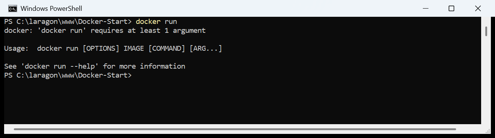

```powershell
docker stop
```

```
docker: 'docker stop' requires at least 1 argument

Usage:  docker stop [OPTIONS] CONTAINER [CONTAINER...]

See 'docker stop --help' for more information
```

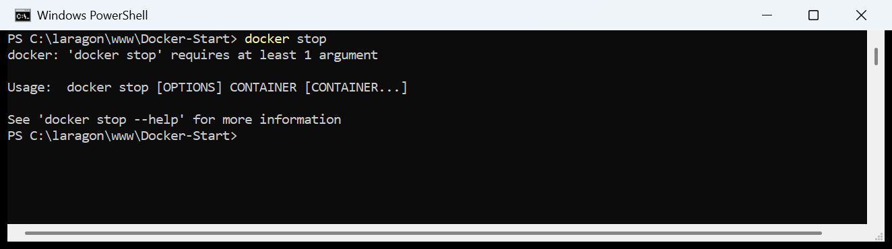

> **Erreur normale, et même utile.** Contrairement à `docker ps` ou
> `docker images` qui savent quoi faire tout seuls, `run` et `stop` ont besoin
> d'une **cible** :
> - `docker run` attend le nom d'une **IMAGE** à instancier ;
> - `docker stop` attend le nom ou l'ID d'un **CONTAINER** à arrêter.
>
> Le message d'erreur affiche directement la syntaxe correcte (`Usage:`), ce qui
> en fait un moyen rapide de retrouver la forme d'une commande sans quitter le
> terminal.
>
> **Comment distinguer une erreur normale d'une vraie panne ?**
>
> | Message | Type | Signification |
> |---|---|---|
> | `requires at least 1 argument` | ✅ Normal | Erreur de syntaxe, il manque un argument |
> | `failed to connect to the docker API` | ❌ Panne | Le moteur n'est pas démarré |
> | `Error response from daemon: conflict` | ✅ Normal | Le moteur répond et refuse pour une bonne raison |
> | `port is already allocated` | ✅ Normal | Le port hôte est déjà pris, en changer |

---

## 5. Récupérer l'image (`docker pull`)

```powershell
docker pull docker/welcome-to-docker
```

```
Using default tag: latest
latest: Pulling from docker/welcome-to-docker
9745203f5d34: Pull complete
fd372c3c84a2: Pull complete
a5585638209e: Pull complete
958a74d6a238: Pull complete
9824c27679d3: Pull complete
828fa206d77b: Pull complete
bdaad27fd04a: Pull complete
c1d2dc189e38: Pull complete
Digest: sha256:c4d56c24da4f009ecf8352146b43497fe78953edb4c679b841732beb97e588b0
Status: Downloaded newer image for docker/welcome-to-docker:latest
docker.io/docker/welcome-to-docker:latest
```

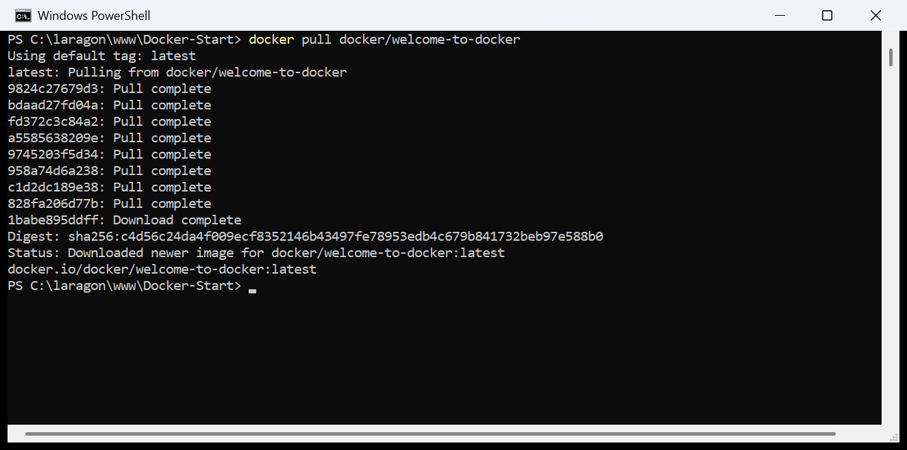

> **Décryptage ligne par ligne :**
> - `Using default tag: latest` — je n'ai pas précisé de version, Docker prend
>   donc `:latest`. La commande complète équivalente serait
>   `docker pull docker/welcome-to-docker:latest`.
> - Les 8 lignes `Pull complete` sont les **couches** (*layers*) de l'image.
>   Une image Docker est un empilement de couches ; elles sont téléchargées en
>   parallèle et mises en cache. Si une couche est déjà présente localement,
>   Docker affiche `Already exists` au lieu de la retélécharger — c'est ce qui
>   rend les `pull` suivants beaucoup plus rapides.
> - `Digest: sha256:...` — l'empreinte cryptographique de l'image, qui garantit
>   qu'on a bien reçu exactement le contenu attendu.
> - `docker.io/docker/welcome-to-docker:latest` — le nom complet. Il se lit
>   `registre / éditeur / image : tag`. `docker.io` (le Docker Hub) étant le
>   registre par défaut, on peut l'omettre.

### Vérification : l'image est bien arrivée

```powershell
docker images docker/welcome-to-docker
```

```
IMAGE                             ID             DISK USAGE   CONTENT SIZE
docker/welcome-to-docker:latest   c4d56c24da4f       22.2MB         6.03MB
```

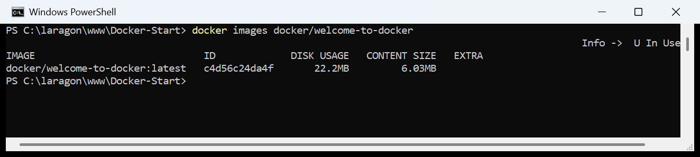

> **À noter :** l'image ne pèse que **22 Mo** sur le disque, contre plus d'1 Go
> pour `mysql:8.0`. C'est une petite application web statique servie par nginx.
> On remarque aussi que `docker pull` a fonctionné **sans être connecté** au
> Docker Hub, puisque l'image est publique.

---

## 6. Lancer le conteneur (`docker run`)

### 6.1 — La commande du sujet et l'erreur du terminal

La commande proposée par le sujet, avec `xxxx` remplacé par le port `8088` :

```powershell
docker run -it --rm -p 8088:80 docker/welcome-to-docker
```

Lancée depuis un terminal Git Bash, elle m'a renvoyé :

```
the input device is not a TTY.  If you are using mintty, try prefixing the command with 'winpty'
```


> **Analyse :** l'option `-t` demande à Docker d'attacher un **pseudo-terminal**
> (TTY) au conteneur. Certains terminaux sous Windows (Git Bash / MinTTY)
> n'exposent pas de vrai TTY, d'où l'erreur.
>
> **Trois corrections possibles :**
> 1. Utiliser **PowerShell** ou **cmd** au lieu de Git Bash — le TTY y est
>    disponible et la commande passe telle quelle ;
> 2. Préfixer par `winpty` : `winpty docker run -it --rm -p 8088:80 ...` ;
> 3. Retirer `-it`, qui n'a de toute façon **aucune utilité ici** (voir ci-dessous).

### 6.2 — La commande que j'ai retenue

```powershell
docker run -d -p 8088:80 --name welcome-exercice docker/welcome-to-docker
```

```
b14c62bed02b815970a6feeb46490a8d03edf78238e7816fac938aaffb59813f
```

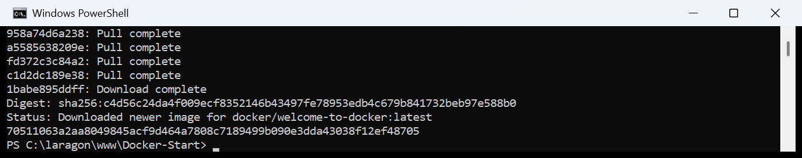

> **Décomposition de chaque option :**
>
> | Option | Rôle |
> |---|---|
> | `-d` (`--detach`) | Lance le conteneur **en arrière-plan** et rend la main au terminal. Sans ça, le terminal reste bloqué sur les logs. |
> | `-p 8088:80` | **Publie** un port : le port `8088` de ma machine est redirigé vers le port `80` du conteneur. **L'ordre est `hôte:conteneur`** — l'inverser est l'erreur la plus courante. |
> | `--name welcome-exercice` | Donne un nom lisible au conteneur, au lieu d'un nom aléatoire du type `nostalgic_bohr`. Beaucoup plus pratique pour les `stop`/`rm` ensuite. |
> | `docker/welcome-to-docker` | L'**image** à instancier. C'est le dernier argument. |
>
> La longue chaîne de 64 caractères renvoyée est l'**ID complet du conteneur**.
> Les 12 premiers caractères (`b14c62bed02b`) suffisent partout ailleurs.
>
> **Pourquoi `-it` est inutile ici, et pourquoi j'ai retiré `--rm` :**
> - `-i` (interactif) et `-t` (TTY) servent quand on veut **taper des commandes
>   dans** le conteneur, typiquement `docker run -it ubuntu bash`. Ici le
>   conteneur fait tourner un serveur web : on n'a rien à lui taper, on le
>   consulte au navigateur. `-d` est bien plus adapté.
> - `--rm` supprime **automatiquement** le conteneur dès qu'il s'arrête. C'est
>   pratique pour un test jetable, mais ça rend l'étape « supprimer votre
>   conteneur » du sujet impossible à démontrer (voir la section 12).

### 6.3 — Vérification : le conteneur tourne

```powershell
docker ps
```

```
CONTAINER ID   IMAGE                      COMMAND                  CREATED          STATUS          PORTS                  NAMES
b14c62bed02b   docker/welcome-to-docker   "/docker-entrypoint.…"   42 seconds ago   Up 42 seconds   0.0.0.0:8088->80/tcp   welcome-exercice
```

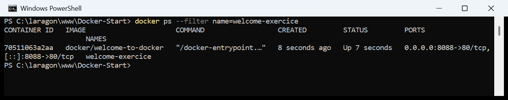

> Le `STATUS` est passé à `Up`, et la colonne `PORTS` confirme la redirection
> `0.0.0.0:8088->80/tcp`. Le conteneur est joignable.

---

## 7. Accéder au conteneur depuis le navigateur

Le sujet demande de « trouver le moyen d'accéder au container » depuis le
navigateur. La réponse se lit directement dans la colonne `PORTS` de `docker ps` :

```
0.0.0.0:8088->80/tcp
        ^^^^
```

Le conteneur est donc accessible à l'adresse :

### 👉 http://localhost:8088

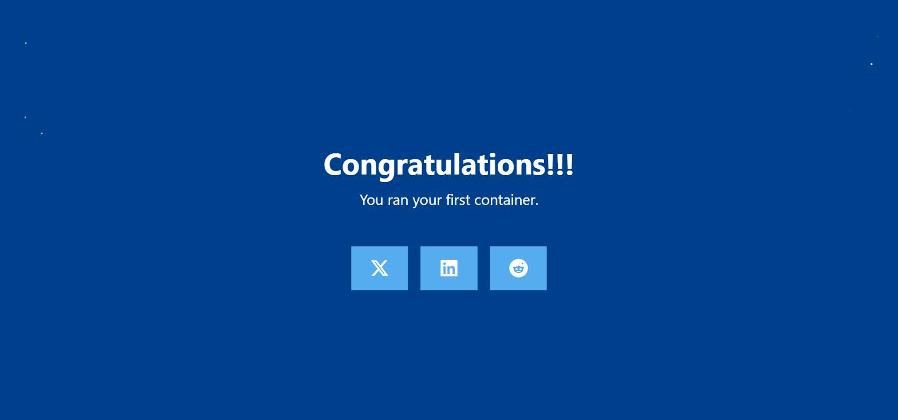

> **Résultat :** la page affiche **« Congratulations!!! You ran your first
> container. »** Le conteneur est bien lancé et sert son contenu.
>
> **Comment trouver le bon port sans deviner :**
> 1. `docker ps` → colonne `PORTS`, c'est le nombre **avant** la flèche ;
> 2. `docker port welcome-exercice` → affiche uniquement les redirections ;
> 3. Dans **Docker Desktop**, onglet *Containers*, le port est un lien cliquable.
>
> **Pourquoi `localhost:8088` et pas `localhost:80` ?** Le port `80` est celui
> **à l'intérieur** du conteneur, isolé du reste de la machine. Sans l'option
> `-p`, le conteneur tournerait très bien mais serait **totalement injoignable**
> depuis le navigateur. C'est le rôle exact de `-p` : percer une porte entre
> l'hôte et le conteneur.

---

## 8. Arrêter le conteneur (`docker stop`)

```powershell
docker stop welcome-exercice
```

```
welcome-exercice
```

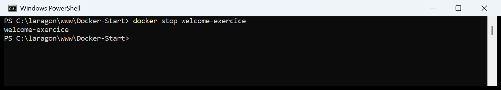

> Docker renvoie simplement le nom du conteneur arrêté : c'est un succès.
> On peut indiquer indifféremment le **nom** (`welcome-exercice`) ou l'**ID**
> (`b14c62bed02b`).
>
> `docker stop` envoie un signal `SIGTERM` au processus principal, lui laissant
> 10 secondes pour se fermer proprement, puis un `SIGKILL` s'il ne répond pas.
> Pour tuer immédiatement sans attendre : `docker kill welcome-exercice`.

### Le conteneur a disparu de `docker ps`… mais existe toujours

```powershell
docker ps
```

```
CONTAINER ID   IMAGE     COMMAND   CREATED   STATUS    PORTS     NAMES
```

```powershell
docker ps -a
```

```
CONTAINER ID   IMAGE                      COMMAND                  CREATED          STATUS                     PORTS   NAMES
b14c62bed02b   docker/welcome-to-docker   "/docker-entrypoint.…"   44 seconds ago   Exited (0) 1 second ago            welcome-exercice
```

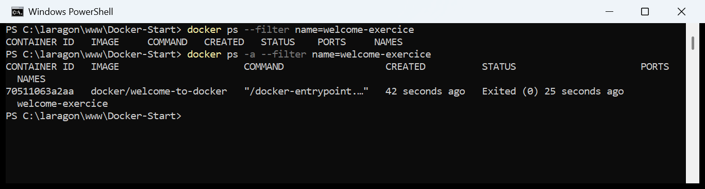

> **C'est le point le plus important de cette étape.** `docker ps` renvoie une
> liste vide, mais le conteneur **n'a pas été supprimé** : `docker ps -a` le
> montre encore, avec le statut `Exited (0)`.
>
> Le `(0)` est le **code de sortie** du processus : `0` = arrêt propre.
> Un code différent de `0` signalerait un plantage.
>
> **Arrêter ≠ supprimer.** Un conteneur arrêté occupe toujours de l'espace disque
> et **réserve toujours son nom** — c'est pour ça qu'un
> `docker run --name welcome-exercice ...` relancé juste après échouerait avec
> `Conflict: the container name is already in use`.
> On peut d'ailleurs le redémarrer tel quel avec `docker start welcome-exercice`.

---

## 9. Supprimer le conteneur (`docker rm`)

```powershell
docker rm welcome-exercice
```

```
welcome-exercice
```

```powershell
docker ps -a
```

```
CONTAINER ID   IMAGE     COMMAND   CREATED   STATUS    PORTS     NAMES
```

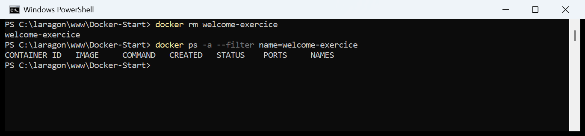

> Cette fois le conteneur est **réellement supprimé** : il n'apparaît plus, même
> avec `docker ps -a`. Le nom `welcome-exercice` est de nouveau disponible.
>
> **Attention à ne pas confondre :**
> - `docker rm` → supprime un **conteneur** ;
> - `docker rmi` → supprime une **image** (le `i` final, comme *image*).
>
> **Un conteneur en marche ne peut pas être supprimé** directement :
> `docker rm` renvoie alors `You cannot remove a running container`.
> Il faut soit l'arrêter d'abord (`docker stop` puis `docker rm`), soit forcer
> avec `docker rm -f`.
>
> ⚠️ La suppression est **définitive** : tout ce qui avait été écrit dans le
> conteneur est perdu. C'est précisément pour ça qu'on utilise des **volumes**
> pour les données à conserver (bases de données, uploads…).

---

## 10. Supprimer l'image (`docker rmi`)

### 10.1 — Erreur rencontrée : l'image est encore utilisée

En essayant de supprimer l'image alors qu'un conteneur (même **arrêté**) était
encore basé dessus :

```powershell
docker rmi docker/welcome-to-docker
```

```
Error response from daemon: conflict: unable to delete docker/welcome-to-docker:latest
(must be forced) - container ee6ce80c3969 is using its referenced image c4d56c24da4f
```

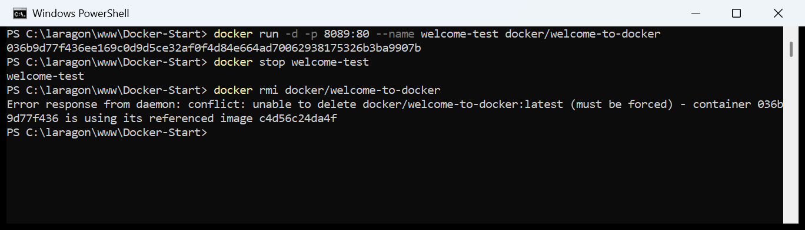

> **Analyse :** Docker refuse de supprimer une image dont **au moins un
> conteneur dépend encore**, même si ce conteneur est à l'arrêt. C'est une
> sécurité : sans son image, un conteneur ne pourrait plus jamais redémarrer.
>
> Le message est très explicite et donne même l'ID du coupable
> (`container ee6ce80c3969`).
>
> **Deux corrections :**
> 1. **Propre** — supprimer d'abord le conteneur, puis l'image :
>    ```powershell
>    docker rm ee6ce80c3969
>    docker rmi docker/welcome-to-docker
>    ```
> 2. **Brutale** — forcer avec `-f` (`docker rmi -f docker/welcome-to-docker`).
>    L'image est alors seulement « détaguée » et le conteneur devient orphelin,
>    incapable de redémarrer. À éviter.

### 10.2 — Suppression réussie

```powershell
docker rm welcome-test
docker rmi docker/welcome-to-docker
```

```
Untagged: docker/welcome-to-docker:latest
Deleted: sha256:c4d56c24da4f009ecf8352146b43497fe78953edb4c679b841732beb97e588b0
```

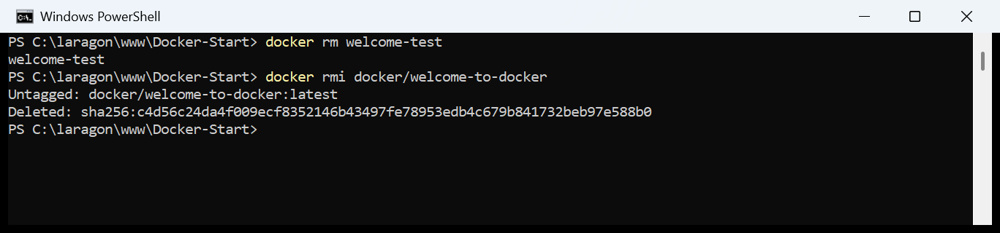

> **Deux lignes, deux opérations distinctes :**
> - `Untagged:` — le **nom** `docker/welcome-to-docker:latest` ne pointe plus
>   vers rien ;
> - `Deleted: sha256:...` — les **données** de l'image sont réellement effacées
>   du disque.
>
> On ne voit `Deleted:` que si plus aucun tag ne référence l'image. Si la même
> image portait deux noms, `docker rmi` sur l'un des deux ne ferait qu'un
> `Untagged:`.

### 10.3 — Vérification finale

```powershell
docker images docker/welcome-to-docker
```

```
IMAGE   ID   DISK USAGE   CONTENT SIZE
```

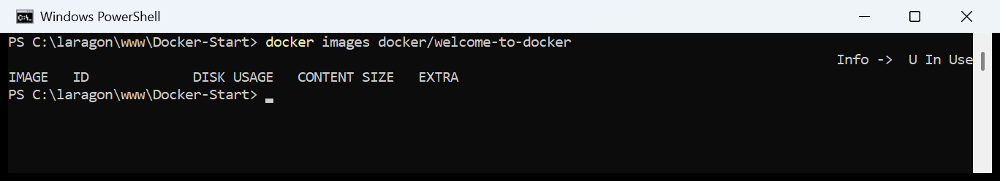

Liste vide : l'environnement est propre. Pour recommencer l'exercice, il suffit
de relancer `docker pull docker/welcome-to-docker`.

---

## 11. Mémo des commandes de suppression

Réponses aux exemples demandés par le sujet.

### Conteneurs

| Action | Commande |
|---|---|
| Un conteneur spécifique | `docker rm welcome-exercice` |
| Plusieurs conteneurs | `docker rm welcome-exercice welcome-test b14c62bed02b` |
| Tous les conteneurs **arrêtés** | `docker container prune` |
| Forcer la suppression d'un conteneur **actif** | `docker rm -f welcome-exercice` |
| *(bonus)* Absolument tous les conteneurs | `docker rm -f $(docker ps -aq)` |

### Images

| Action | Commande |
|---|---|
| Une image spécifique | `docker rmi docker/welcome-to-docker` |
| Plusieurs images | `docker rmi docker/welcome-to-docker nginx:alpine busybox:latest` |
| Toutes les images **non utilisées** (*dangling*) | `docker image prune` |
| Toutes les images **inutilisées** (aucun conteneur ne s'en sert) | `docker image prune -a` |
| Forcer la suppression d'une image | `docker rmi -f docker/welcome-to-docker` |

### ⚠️ Le sujet liste deux fois la même chose — sauf que non

Le sujet demande à la fois « **toutes les images inutilisées** » et « **toutes
les images non utilisées** ». Formulé en français, ça semble être un doublon.
En réalité Docker distingue bien **deux notions différentes**, et c'est un piège
classique :

| Notion | Définition | Commande |
|---|---|---|
| Image **dangling** | Image sans aucun tag, typiquement l'ancienne version écrasée par un `docker build`. Elle apparaît en `<none>` dans `docker images`. | `docker image prune` |
| Image **unused** | Toute image (taguée ou non) qu'**aucun conteneur** n'utilise actuellement. | `docker image prune -a` |

> **En clair :** `docker image prune` fait un nettoyage **sûr** (il ne touche
> qu'aux déchets de build). `docker image prune -a` est **bien plus agressif** :
> il supprime `nginx`, `mysql` et toutes les images qu'on garde « au cas où »,
> obligeant à tout retélécharger ensuite.

### Nettoyage global

| Action | Commande |
|---|---|
| Conteneurs arrêtés + réseaux + images dangling + cache de build | `docker system prune` |
| Idem **+ toutes** les images inutilisées **+ les volumes** | `docker system prune -a --volumes` |
| Voir ce que Docker occupe sur le disque | `docker system df` |

> 🛑 `docker system prune -a --volumes` supprime **les volumes**, donc les
> **données de bases de données**. Toujours lancer `docker system df` avant,
> pour voir ce qu'on s'apprête à perdre.

---

## 12. L'erreur présente dans les commandes du sujet

> *« Quel erreur est présente dans les commandes données ci-dessus, donner la
> correction »*

### Erreur principale : l'option `--rm` rend les étapes suivantes impossibles

La commande donnée par le sujet est :

```powershell
docker run -it --rm -p xxxx:80 "nom de l'image"
```

**Le problème :** l'option `--rm` demande à Docker de **supprimer
automatiquement le conteneur dès qu'il s'arrête**.

Or le sujet demande, juste après, de :
1. « **Arrêter** votre container » → `docker stop` ;
2. « **Supprimer** votre container » → `docker rm`.

Avec `--rm`, l'étape 2 est **impossible** : au moment où le `docker stop`
se termine, le conteneur a déjà été détruit par Docker. La commande `docker rm`
renvoie alors :

```
Error response from daemon: No such container: welcome-exercice
```

Et `docker ps -a` ne montre plus rien — on ne peut donc jamais observer l'état
`Exited`, qui est pourtant toute la leçon de l'étape 8.

**Correction :**

```powershell
docker run -d -p 8088:80 --name welcome-exercice docker/welcome-to-docker
```

- `--rm` retiré → le conteneur survit à son arrêt et peut être supprimé
  manuellement ;
- `-it` remplacé par `-d` → un serveur web n'a pas besoin de terminal
  interactif, et `-d` rend la main au terminal ;
- `--name` ajouté → on peut viser le conteneur par un nom lisible.

### Erreurs secondaires

| # | Erreur | Correction |
|---|---|---|
| 2 | Les **guillemets typographiques** `“nom de l'image”` (copiés depuis un traitement de texte) ne sont pas des guillemets valides pour un terminal : le shell les prend au pied de la lettre et cherche une image dont le nom commence par `“`. | Écrire le nom **sans guillemets** : `docker/welcome-to-docker`. Le nom d'une image ne contient jamais d'espace, les guillemets sont inutiles. |
| 3 | `-it` provoque `the input device is not a TTY` sous Git Bash / MinTTY. | Utiliser **PowerShell** ou **cmd**, préfixer par `winpty`, ou retirer `-it`. |
| 4 | Le port `xxxx` est laissé à choisir, mais `80` et `8080` sont très souvent déjà pris (Laragon, WAMP, autres projets) → `port is already allocated`. | Choisir un port libre au-dessus de `1024`, ici **`8088`**. Vérifier avant avec `netstat -ano \| findstr :8088`. |
| 5 | `docker pull` est listé sans argument, comme `docker run` et `docker stop`. | Toutes ces commandes exigent une cible : `docker pull docker/welcome-to-docker`. |

---

## 13. Récapitulatif du cycle de vie

```
                        docker pull
   [ Docker Hub ] ─────────────────────────► [ Image locale ]
                                                    │
                                                    │ docker run -d -p 8088:80
                                                    ▼
                                            [ Conteneur actif ]  ◄── docker ps
                                                    │       ▲
                                        docker stop │       │ docker start
                                                    ▼       │
                                            [ Conteneur arrêté ] ◄── docker ps -a
                                                    │
                                          docker rm │
                                                    ▼
                                               ( supprimé )
                                                    │
                                         docker rmi │  (image libérée)
                                                    ▼
                                               ( supprimée )
```

### Toutes les commandes du job, dans l'ordre

```powershell
# 1. Vérifications
docker --version
docker info
docker ps
docker ps -a
docker images

# 2. Connexion au Docker Hub (facultatif pour une image publique)
docker login

# 3. Récupérer l'image
docker pull docker/welcome-to-docker
docker images docker/welcome-to-docker

# 4. Lancer le conteneur
docker run -d -p 8088:80 --name welcome-exercice docker/welcome-to-docker
docker ps

# 5. Y accéder     ->  http://localhost:8088

# 6. Arrêter
docker stop welcome-exercice
docker ps
docker ps -a

# 7. Supprimer le conteneur
docker rm welcome-exercice
docker ps -a

# 8. Supprimer l'image
docker rmi docker/welcome-to-docker
docker images
```

---

## 14. Ce que j'ai retenu

1. **Docker, c'est deux programmes.** Le client (`docker`) et le moteur
   (`dockerd`). Si le moteur est éteint, `docker --version` répond quand même —
   ce qui donne la fausse impression que tout va bien. Le vrai test, c'est
   `docker info` et son bloc `Server:`.

2. **Image ≠ conteneur.** L'image est le modèle figé, le conteneur en est une
   instance vivante. D'où deux commandes de suppression : `docker rm` pour les
   conteneurs, `docker rmi` pour les images.

3. **`docker ps` ment par omission.** Il ne montre que ce qui tourne. Un
   conteneur arrêté existe toujours, occupe du disque et réserve son nom : il
   faut `docker ps -a` pour le voir.

4. **`-p hôte:conteneur`, jamais l'inverse.** Sans cette option, le conteneur
   tourne mais reste totalement injoignable depuis le navigateur.

5. **Toutes les erreurs ne sont pas des pannes.** `requires at least 1 argument`
   est une faute de frappe ; `failed to connect to the docker API` est une vraie
   panne ; `conflict: ... is using its referenced image` est une sécurité qui
   fonctionne comme prévu. Lire le message jusqu'au bout, il contient presque
   toujours la correction.

6. **`--rm` est un piège pédagogique.** Très pratique pour un test jetable, mais
   il empêche d'observer le cycle de vie complet d'un conteneur.

7. **Nommer ses conteneurs (`--name`) fait gagner un temps fou.** Manipuler
   `welcome-exercice` est bien plus confortable que copier-coller
   `b14c62bed02b` à chaque commande.

---

## Ressources

- [docker/welcome-to-docker](https://github.com/docker/welcome-to-docker) — l'image du job
- [Documentation officielle Docker](https://docs.docker.com/)
- [Docker — Get started](https://docs.docker.com/get-started/)
- [Docker Hub](https://hub.docker.com/)
- [Référence CLI `docker run`](https://docs.docker.com/reference/cli/docker/container/run/)
