# Jour 1 — Job 02 : Welcome to Docker (Part 2) — Construire et publier son image

> Formation développeur web — **La Plateforme**
> Objectif : cloner un projet, comprendre son `Dockerfile`, en **construire**
> l'image, modifier le code source, **reconstruire** l'image, puis la **publier**
> sur le Docker Hub.

Projet de travail : **[docker/welcome-to-docker](https://github.com/docker/welcome-to-docker)**
— la même application que le [Job 01](../job-01-welcome-to-docker/README.md),
mais cette fois on part du **code source** au lieu d'une image toute faite.

---

## Sommaire

1. [La différence avec le Job 01](#1-la-différence-avec-le-job-01)
2. [Cloner le projet](#2-cloner-le-projet)
3. [Analyser le Dockerfile](#3-analyser-le-dockerfile)
4. [Le README du projet](#4-le-readme-du-projet)
5. [Construire l'image (`docker build`)](#5-construire-limage-docker-build)
6. [Lancer un conteneur depuis l'image construite](#6-lancer-un-conteneur-depuis-limage-construite)
7. [Modifier le code source](#7-modifier-le-code-source)
8. [Reconstruire l'image et voir le cache travailler](#8-reconstruire-limage-et-voir-le-cache-travailler)
9. [Vérifier la prise en compte des modifications](#9-vérifier-la-prise-en-compte-des-modifications)
10. [Pourquoi il faut reconstruire — et comment l'éviter en développement](#10-pourquoi-il-faut-reconstruire--et-comment-léviter-en-développement)
11. [Publier l'image sur le Docker Hub](#11-publier-limage-sur-le-docker-hub)
12. [Récupérer et modifier l'image d'un membre de la promo](#12-récupérer-et-modifier-limage-dun-membre-de-la-promo)
13. [Récapitulatif des commandes](#13-récapitulatif-des-commandes)
14. [Ce que j'ai retenu](#14-ce-que-jai-retenu)

---

## 1. La différence avec le Job 01

C'est le point à bien saisir avant de commencer, parce que les deux jobs
utilisent la même application mais **pas la même image**.

| | Job 01 | Job 02 |
|---|---|---|
| Point de départ | Une image **déjà construite** sur le Docker Hub | Le **code source** sur GitHub |
| Commande d'entrée | `docker pull docker/welcome-to-docker` | `git clone` puis `docker build` |
| Serveur web dans l'image | **nginx**, sur le port **80** | **serve** (Node.js), sur le port **3000** |
| Commande de lancement | `docker run -d -p 8088:80 ...` | `docker run -d -p 8088:3000 ...` |
| Taille de l'image | 22 Mo | 473 Mo |

> ⚠️ **Le piège du port.** Reprendre `-p 8088:80` du Job 01 ne marcherait pas
> ici : l'image que je construis n'écoute pas sur le port 80 mais sur le **3000**
> (c'est le `EXPOSE 3000` du Dockerfile). Le conteneur démarrerait sans erreur,
> mais `http://localhost:8088` ne répondrait pas — Docker aurait branché le port
> 8088 sur un port 80 où personne n'écoute.
>
> **La différence de taille** (22 Mo contre 473 Mo) s'explique de la même
> façon : l'image officielle du Hub est une image `nginx:alpine` ne contenant
> que les fichiers HTML/CSS/JS compilés, alors que la mienne embarque tout
> l'environnement **Node.js 22** ayant servi à la compilation.

---

## 2. Cloner le projet

```powershell
git clone https://github.com/docker/welcome-to-docker.git
```

```
Cloning into 'welcome-to-docker'...
remote: Enumerating objects: 225, done.
remote: Counting objects: 100% (20/20), done.
remote: Compressing objects: 100% (10/10), done.
remote: Total 225 (delta 17), reused 10 (delta 10), pack-reused 205 (from 2)
Receiving objects: 100% (225/225), 503.39 KiB | 5.41 MiB/s, done.
Resolving deltas: 100% (110/110), done.
```

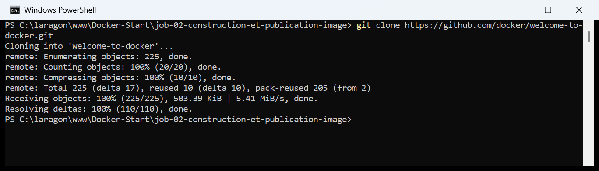

### Ce que contient le projet

```powershell
cd welcome-to-docker
ls
```

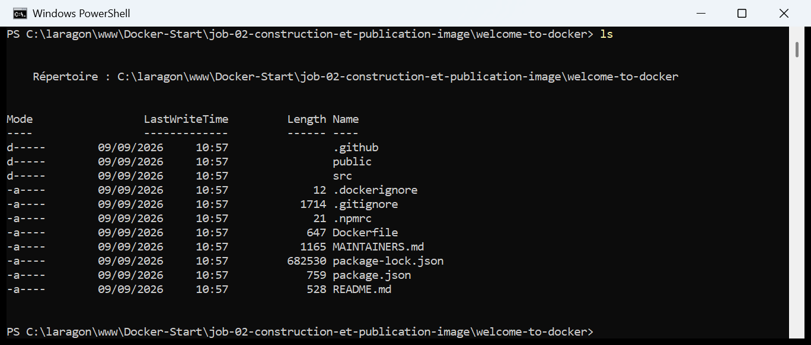

| Fichier / dossier | Rôle |
|---|---|
| `Dockerfile` | La **recette** de l'image : c'est lui que `docker build` va lire |
| `.dockerignore` | Les fichiers à **exclure** du contexte de build (ici `node_modules`) |
| `package.json` | Les dépendances npm et les scripts du projet React |
| `src/` | Le **code source** de l'application (c'est ici que je vais modifier) |
| `public/` | Le `index.html` de base et le favicon |
| `README.md` | La documentation du projet, avec les commandes de build |

---

## 3. Analyser le Dockerfile

```powershell
cat Dockerfile
```

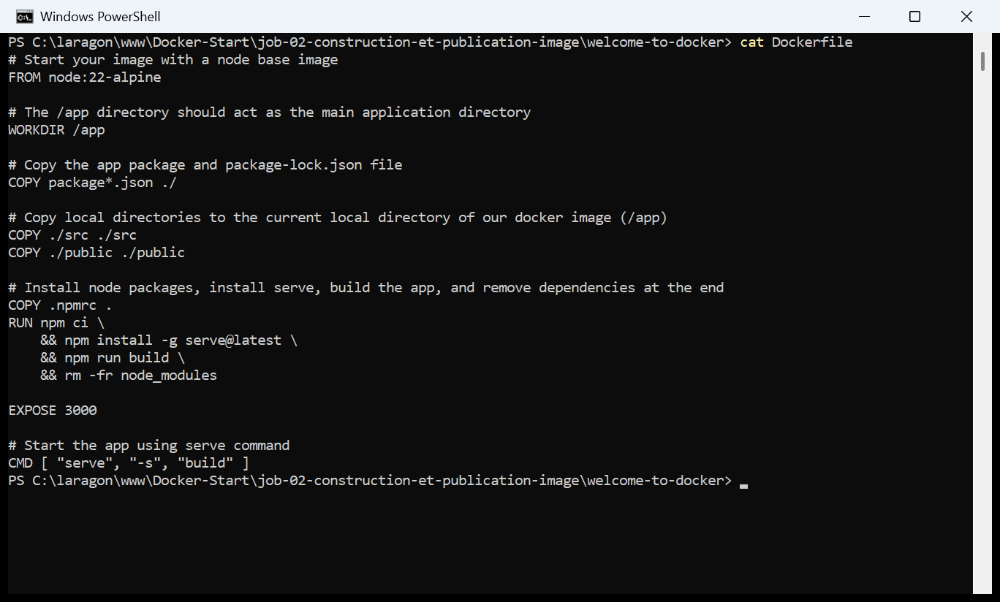

Le fichier complet, instruction par instruction :

```dockerfile
FROM node:22-alpine

WORKDIR /app

COPY package*.json ./

COPY ./src ./src
COPY ./public ./public

COPY .npmrc .
RUN npm ci \
    && npm install -g serve@latest \
    && npm run build \
    && rm -fr node_modules

EXPOSE 3000

CMD [ "serve", "-s", "build" ]
```

| Instruction | Ce qu'elle fait |
|---|---|
| `FROM node:22-alpine` | **L'image de base.** On ne part jamais de zéro : ici, une Alpine Linux avec Node.js 22 déjà installé. `alpine` est une distribution Linux minimaliste (~5 Mo), c'est pour ça qu'on la choisit souvent. |
| `WORKDIR /app` | Définit `/app` comme **répertoire de travail** à l'intérieur de l'image. Toutes les instructions suivantes s'exécutent depuis là. Équivaut à un `cd`, mais crée aussi le dossier s'il n'existe pas. |
| `COPY package*.json ./` | Copie `package.json` **et** `package-lock.json` depuis ma machine vers `/app` dans l'image. Le `*` est un joker. |
| `COPY ./src ./src` | Copie le code source. **C'est cette ligne qui rend la reconstruction obligatoire** quand je modifie l'application (voir §8). |
| `COPY ./public ./public` | Copie les fichiers statiques (`index.html`, favicon). |
| `RUN npm ci && ... && npm run build && rm -fr node_modules` | **La seule instruction qui exécute vraiment quelque chose pendant le build** : installe les dépendances, installe `serve`, compile le React dans `/app/build`, puis supprime `node_modules`. |
| `EXPOSE 3000` | **Documente** le port sur lequel l'application écoute. Attention : ça n'ouvre rien tout seul, il faut quand même `-p` au `docker run`. |
| `CMD [ "serve", "-s", "build" ]` | La commande lancée **au démarrage du conteneur** (pas pendant le build). Démarre le serveur statique sur le dossier `build`. |

> **`RUN` contre `CMD`, la confusion classique :**
> - `RUN` s'exécute **une fois, à la construction** de l'image, et son résultat
>   est figé dans une couche.
> - `CMD` ne s'exécute **pas** à la construction : c'est la commande par défaut
>   lancée **à chaque démarrage** d'un conteneur.
>
> **Pourquoi tout est enchaîné avec `&&` sur une seule ligne `RUN` ?** Parce que
> **chaque instruction du Dockerfile crée une couche**. En quatre `RUN` séparés,
> le `node_modules` installé par le premier resterait stocké dans sa couche même
> après avoir été supprimé par le dernier — l'image pèserait des centaines de Mo
> de plus. Regroupé en un seul `RUN`, l'installation et la suppression ont lieu
> dans la **même** couche : seul le résultat final est conservé.
>
> **Et le `.dockerignore` ?** Il contient `node_modules`. Sans lui, le dossier
> `node_modules` local (souvent plusieurs centaines de Mo) serait envoyé au
> moteur Docker à chaque build, pour rien. Ici le contexte envoyé ne pèse que
> **709 ko** (visible dans la capture du build).

---

## 4. Le README du projet

```powershell
cat README.md
```

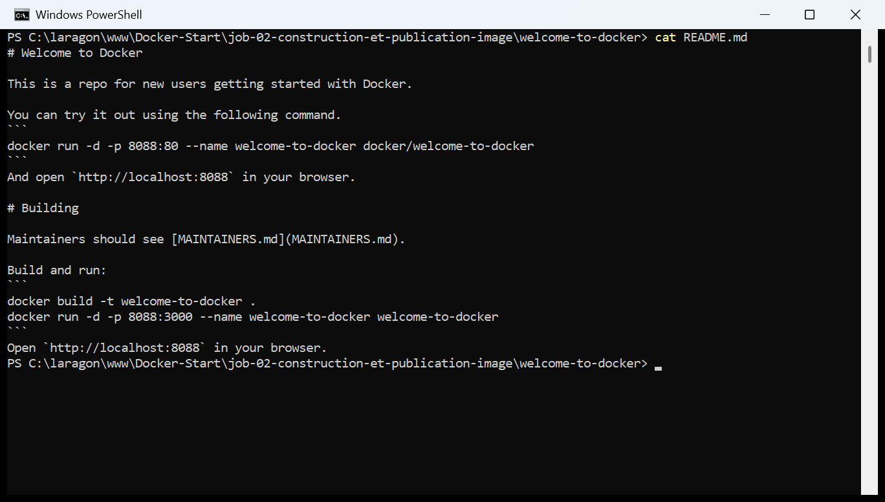

Le README du projet donne lui-même les deux commandes attendues :

```
docker build -t welcome-to-docker .
docker run -d -p 8088:3000 --name welcome-to-docker welcome-to-docker
```

> C'est là qu'on trouve la confirmation du port : le README officiel mappe bien
> `8088:3000` pour l'image construite depuis les sources, alors qu'il utilise
> `8088:80` pour l'image téléchargée du Hub. Les deux commandes cohabitent dans
> ce même fichier — de quoi se tromper facilement si on lit trop vite.

---

## 5. Construire l'image (`docker build`)

```powershell
docker build -t welcome-to-docker:v1 .
```

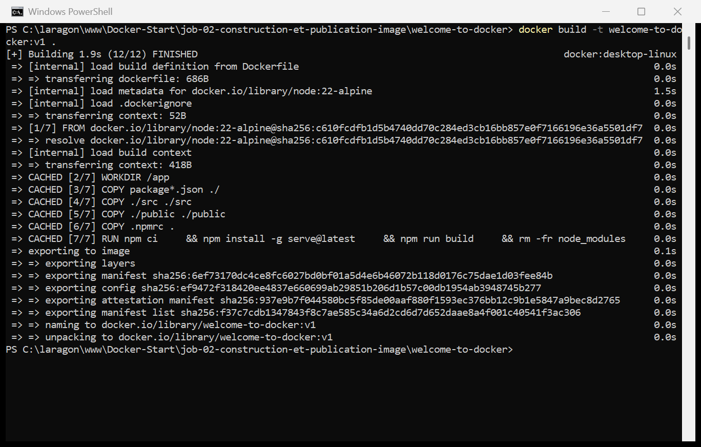

> **Décomposition de la commande :**
>
> | Élément | Rôle |
> |---|---|
> | `docker build` | Lit un `Dockerfile` et fabrique une image |
> | `-t welcome-to-docker:v1` | **Tag** de l'image : son nom (`welcome-to-docker`) et sa version (`v1`). Sans `-t`, l'image n'aurait aucun nom et n'apparaîtrait qu'avec un ID dans `docker images`. |
> | `.` | **Le contexte de build** : le dossier envoyé au moteur Docker. Le point signifie « le dossier courant ». C'est aussi là que Docker cherche le `Dockerfile` par défaut. |
>
> **Le `.` final est obligatoire** et c'est l'oubli le plus fréquent :
> `docker build -t welcome-to-docker:v1` sans point renvoie
> `"docker buildx build" requires exactly 1 argument`.
>
> **Comment le Dockerfile est-il « pris en compte » ?** C'est la question du
> sujet. Réponse : automatiquement, parce qu'il s'appelle exactement
> `Dockerfile` et qu'il se trouve à la racine du contexte. S'il portait un autre
> nom ou vivait ailleurs, il faudrait le désigner avec `-f` :
> `docker build -f docker/Dockerfile.prod -t mon-image .`

### Vérification : l'image existe

```powershell
docker images welcome-to-docker
```

```
IMAGE                  ID             DISK USAGE   CONTENT SIZE
welcome-to-docker:v1   f37c7cdb1347        473MB          128MB
```

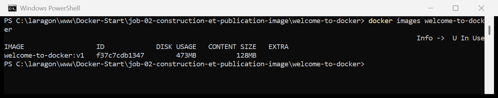

> L'image porte bien le nom et le tag demandés. Elle n'existe **que sur ma
> machine** pour l'instant : rien n'a été envoyé sur le Docker Hub (ce sera
> l'étape 11).

---

## 6. Lancer un conteneur depuis l'image construite

```powershell
docker run -d -p 8088:3000 --name welcome-v1 welcome-to-docker:v1
docker ps --filter name=welcome-v1
```

```
NAMES        IMAGE                  STATUS         PORTS
welcome-v1   welcome-to-docker:v1   Up 7 seconds   0.0.0.0:8088->3000/tcp
```

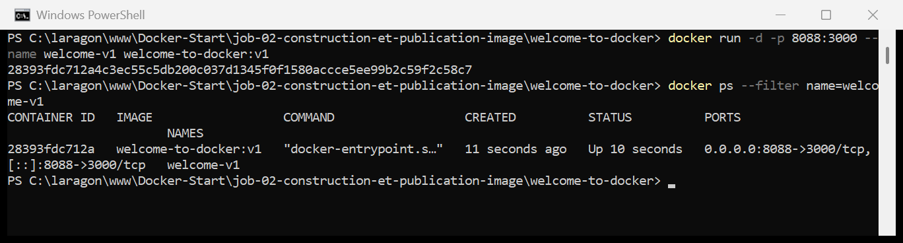

### Accès au conteneur

### 👉 http://localhost:8088

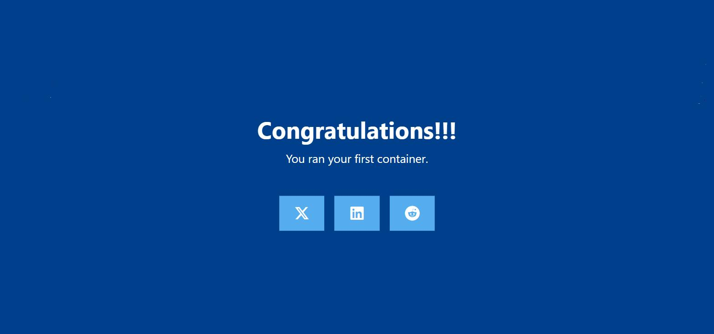

> On retrouve exactement la page du Job 01 (« Congratulations!!! »), ce qui est
> normal : c'est la même application. La différence est invisible à l'écran mais
> réelle — cette page est servie par une image que **j'ai construite**, pas
> téléchargée.

---

## 7. Modifier le code source

J'ai modifié deux fichiers dans `src/` :

- **`src/App.js`** — le titre, le texte, et une ligne de signature ;
- **`src/App.css`** — la couleur de fond, pour que la modification soit
  impossible à rater à l'écran.

```powershell
git diff --stat
git diff src/App.js
```

```
 src/App.css | 2 +-
 src/App.js  | 9 ++++++---
 2 files changed, 7 insertions(+), 4 deletions(-)
```

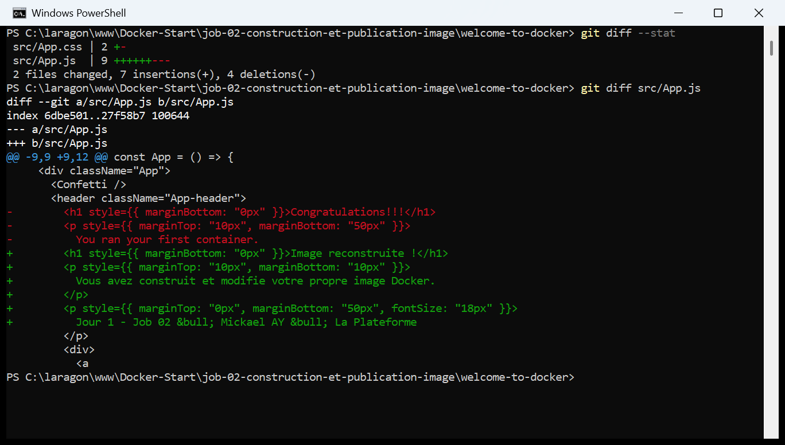

Le détail des changements :

```diff
- <h1 style={{ marginBottom: "0px" }}>Congratulations!!!</h1>
- <p style={{ marginTop: "10px", marginBottom: "50px" }}>
-   You ran your first container.
- </p>
+ <h1 style={{ marginBottom: "0px" }}>Image reconstruite !</h1>
+ <p style={{ marginTop: "10px", marginBottom: "10px" }}>
+   Vous avez construit et modifie votre propre image Docker.
+ </p>
+ <p style={{ marginTop: "0px", marginBottom: "50px", fontSize: "18px" }}>
+   Jour 1 - Job 02 &bull; Mickael AY &bull; La Plateforme
+ </p>
```

```diff
  .App-header {
-   background-color: #003f8c;
+   background-color: #0d5c3f;
```

> **Le point important : à cet instant précis, rien n'a changé pour Docker.**
> Le conteneur `welcome-v1` tourne toujours et sert toujours l'ancienne page.
> J'ai modifié des fichiers **sur ma machine**, pas dans l'image — et l'image
> est un modèle **figé**.

---

## 8. Reconstruire l'image et voir le cache travailler

```powershell
docker build -t welcome-to-docker:v2 .
```

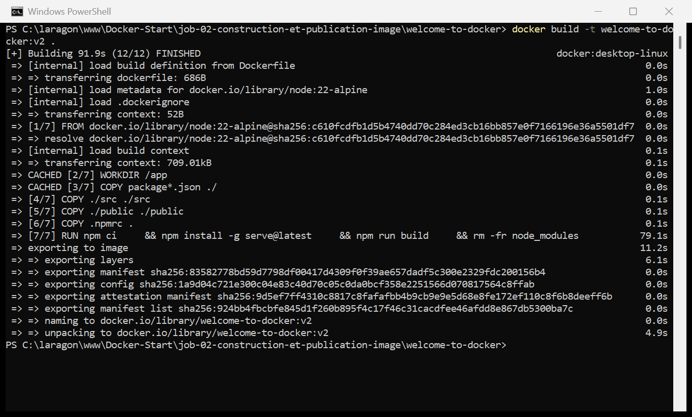

**Cette capture est la plus instructive du job.** On y lit le mécanisme de cache
de Docker en direct :

```
=> CACHED [2/7] WORKDIR /app                                          0.0s
=> CACHED [3/7] COPY package*.json ./                                 0.0s
=>        [4/7] COPY ./src ./src                                      0.1s
=>        [5/7] COPY ./public ./public                                0.1s
=>        [6/7] COPY .npmrc .                                         0.1s
=>        [7/7] RUN npm ci && npm install -g serve@latest && ...      79.1s
```

> **Comment lire ça :**
> - Les étapes **2 et 3** sont marquées `CACHED` : ni le `WORKDIR` ni le
>   `package.json` n'ont changé, Docker réutilise les couches existantes en
>   `0.0s`.
> - L'étape **4** (`COPY ./src ./src`) n'est **pas** cachée : j'ai modifié
>   `src/App.js` et `src/App.css`, le contenu copié est donc différent.
> - **Et à partir de là, tout est recalculé** : les étapes 5, 6 et 7 perdent le
>   cache elles aussi, même si `public/` et `.npmrc` n'ont pas bougé.
>
> **La règle :** dès qu'une couche est invalidée, **toutes celles qui suivent le
> sont aussi**. C'est logique — chaque couche est construite par-dessus la
> précédente. C'est aussi pour ça que le `RUN npm ci` a repris 79 secondes.
>
> **La conséquence pratique** — et c'est un vrai réflexe de développeur : dans un
> Dockerfile, on place les instructions **de la plus stable à la plus
> changeante**. C'est exactement pourquoi `COPY package*.json ./` est **avant**
> `COPY ./src ./src` : les dépendances changent rarement, le code change tout le
> temps. Si les deux `COPY` étaient inversés, npm réinstallerait tout à la
> moindre virgule modifiée.

### Les deux images cohabitent

```powershell
docker images welcome-to-docker
```

```
IMAGE                  ID             DISK USAGE   CONTENT SIZE
welcome-to-docker:v1   f37c7cdb1347        473MB          128MB
welcome-to-docker:v2   924bb4fbcbfe        473MB          128MB
```

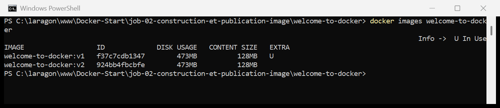

> Deux images distinctes, deux IDs différents. Le **tag** (`:v1`, `:v2`) sert
> exactement à ça : garder plusieurs versions d'une même image et pouvoir
> revenir en arrière. Si j'avais reconstruit avec le même tag `:v1`, l'ancienne
> image aurait été **détaguée** et serait apparue en `<none>` dans
> `docker images` — c'est ce qu'on appelle une image *dangling*
> (voir le [mémo du Job 01](../job-01-welcome-to-docker/README.md#11-mémo-des-commandes-de-suppression)).

---

## 9. Vérifier la prise en compte des modifications

```powershell
docker run -d -p 8090:3000 --name welcome-v2 welcome-to-docker:v2
docker ps --filter name=welcome-
```

```
NAMES        IMAGE                  STATUS              PORTS
welcome-v2   welcome-to-docker:v2   Up About a minute   0.0.0.0:8090->3000/tcp
welcome-v1   welcome-to-docker:v1   Up 8 minutes        0.0.0.0:8088->3000/tcp
```

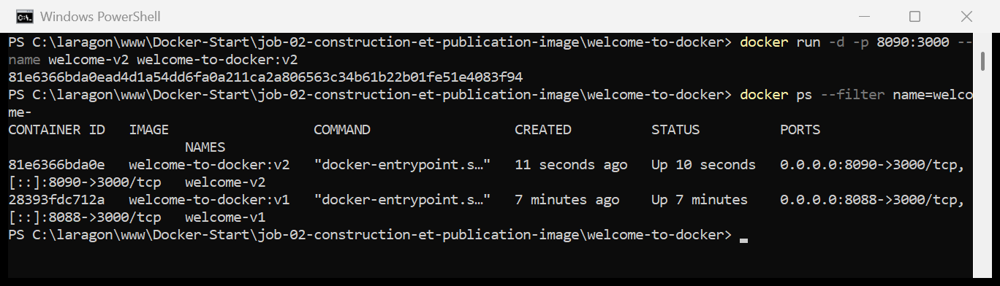

> J'ai volontairement lancé le v2 sur le port **8090** pour garder le v1 sur le
> **8088**. Les deux conteneurs tournent en même temps, à partir de deux images
> différentes — une bonne façon de vérifier la modification côte à côte.
>
> Il fallait un port différent : réutiliser 8088 aurait donné
> `Bind for 0.0.0.0:8088 failed: port is already allocated`.

### 👉 http://localhost:8090

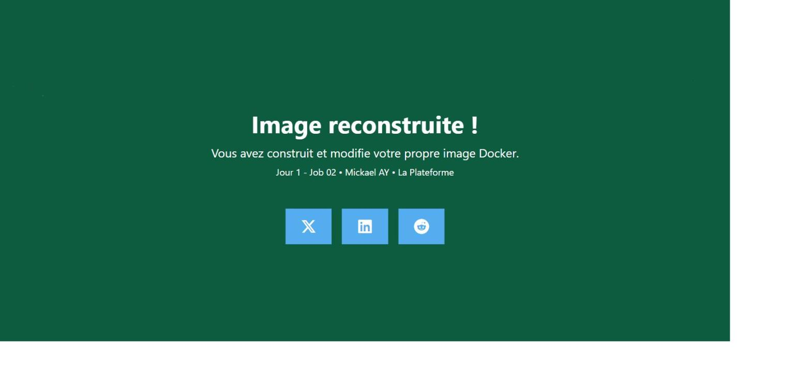

> **La modification est bien dans l'image :** nouveau titre, nouveau texte,
> signature, et fond vert au lieu de bleu.
>
> **Et pendant ce temps, `http://localhost:8088` affiche toujours l'ancienne
> page bleue.** C'est la démonstration la plus parlante du job : le conteneur
> `welcome-v1` a été créé à partir de l'image `v1`, il continuera d'afficher le
> contenu de l'image `v1` jusqu'à sa suppression, quoi que je change dans mes
> fichiers sources.

---

## 10. Pourquoi il faut reconstruire — et comment l'éviter en développement

> *« Comprenez ce qu'il faut faire pour que ce soit pris en compte »*

### La réponse à la question du sujet

Modifier le code source ne suffit **jamais**. Il faut refaire la chaîne
complète, dans cet ordre :

```powershell
# 1. Reconstruire l'image (le COPY ./src reprend les fichiers modifiés)
docker build -t welcome-to-docker:v2 .

# 2. Supprimer l'ancien conteneur (il est lié à l'ancienne image)
docker rm -f welcome-v1

# 3. Recréer un conteneur à partir de la nouvelle image
docker run -d -p 8088:3000 --name welcome-v1 welcome-to-docker:v2
```

**Trois erreurs de raisonnement à éviter :**

| Ce qu'on est tenté de faire | Pourquoi ça ne marche pas |
|---|---|
| `docker restart welcome-v1` | Redémarre le **même** conteneur, issu de la **même** image figée. Le code n'a pas changé à l'intérieur. |
| `docker stop` puis `docker start` | Idem — `start` relance le conteneur existant, il ne le recrée pas. |
| Reconstruire l'image sans recréer le conteneur | L'image `v2` existe, mais le conteneur qui tourne pointe toujours sur `v1`. Un conteneur ne « suit » pas les mises à jour de son image. |

### Le raccourci du développeur : le volume (bind mount)

Reconstruire à chaque virgule modifiée est intenable en développement — ici,
79 secondes de `npm ci` à chaque fois. La vraie solution est de **monter** le
dossier source depuis la machine hôte dans le conteneur, avec `-v` :

```powershell
docker run -d -p 8088:3000 -v ${PWD}/src:/app/src --name welcome-dev welcome-to-docker:v2
```

> **Ce que fait `-v chemin_hote:chemin_conteneur` :** au lieu d'utiliser la copie
> figée du dossier `src` enregistrée dans l'image, le conteneur lit directement
> le dossier `src` de ma machine. Les modifications sont visibles
> **immédiatement**, sans reconstruire quoi que ce soit.
>
> ⚠️ Sur ce projet précis, le montage seul ne suffirait pas : l'application est
> servie **compilée** depuis `/app/build`, pas depuis `/app/src`. Il faudrait
> monter le projet et lancer `npm start` (le serveur de développement de React)
> à la place de `serve -s build`. Le principe reste le même, et c'est exactement
> ce que fait Docker Compose sur un vrai projet.
>
> **À retenir :** `-v` pour développer, `docker build` pour livrer. On ne
> déploie jamais en production avec un volume monté sur le code.

---

## 11. Publier l'image sur le Docker Hub

### 11.1 — Se connecter

```powershell
docker login
```

```
Authenticating with existing credentials... [Username: mickael1995]

 Info -> To login with a different account, run 'docker logout' followed by 'docker login'

Login Succeeded
```

> **Le piège que j'ai rencontré à la création du compte :** un **Docker ID**
> n'accepte que des **lettres minuscules et des chiffres**, entre 4 et 30
> caractères — ni majuscule, ni tiret, ni point. Un identifiant contenant des
> majuscules est refusé avec un message générique *« Something went wrong. Try
> again. »* qui n'explique rien.
>
> **Deuxième piège :** être connecté dans **Docker Desktop** ne connecte pas
> forcément la **ligne de commande**. Le fichier `~/.docker/config.json`
> affichait encore `"auths": {}`. Un `docker login` dans le terminal récupère la
> session existante de Docker Desktop et complète l'authentification sans rien
> redemander.

### 11.2 — Première tentative : l'erreur attendue

Publier l'image telle quelle échoue :

```powershell
docker push welcome-to-docker:v2
```

```
push access denied, repository does not exist or may require authorization:
server message: insufficient_scope: authorization failed
```

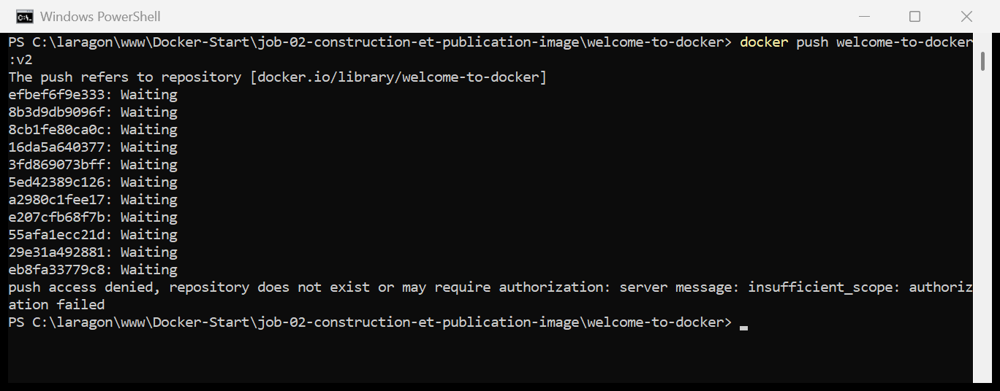

> **Analyse :** l'image s'appelle `welcome-to-docker:v2`, sans espace de nom.
> Docker complète alors le nom en `docker.io/library/welcome-to-docker` —
> `library/`, c'est l'espace réservé aux **images officielles** de Docker.
> Évidemment, je n'ai pas le droit d'y publier.
>
> À noter : les couches passent d'abord en `Waiting`, le refus n'arrive qu'après.
> L'authentification est bien passée, c'est l'**autorisation** sur ce dépôt
> précis qui est refusée — d'où `insufficient_scope`.

### 11.3 — Retaguer avec le nom du compte

```powershell
docker tag welcome-to-docker:v2 mickael1995/welcome-to-docker:v2
docker images | Select-String welcome-to-docker
```

```
mickael1995/welcome-to-docker:v2   924bb4fbcbfe   473MB   128MB
welcome-to-docker:v1               f37c7cdb1347   473MB   128MB
welcome-to-docker:v2               924bb4fbcbfe   473MB   128MB
```

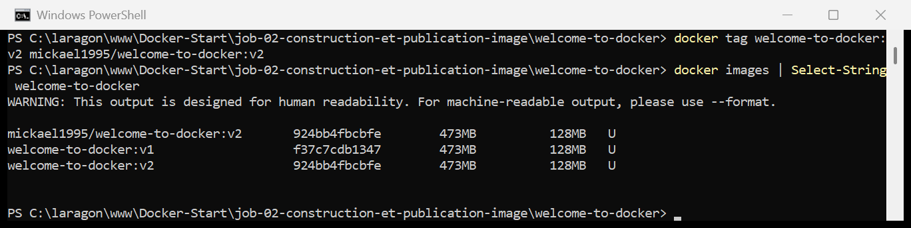

> **Le détail qui fait tout comprendre :** `mickael1995/welcome-to-docker:v2` et
> `welcome-to-docker:v2` ont **exactement le même ID** (`924bb4fbcbfe`).
>
> `docker tag` ne copie **rien** : il pose simplement une seconde étiquette sur
> la même image. C'est pour ça que la commande est instantanée sur 473 Mo, et
> pourquoi `docker images` semble afficher deux fois la même taille — l'image
> n'occupe le disque qu'une seule fois.
>
> Le format complet d'un nom d'image est `registre/utilisateur/image:tag`.
> Comme `docker.io` est le registre par défaut, `mickael1995/welcome-to-docker:v2`
> suffit.

### 11.4 — Publier

```powershell
docker push mickael1995/welcome-to-docker:v2
```

```
The push refers to repository [docker.io/mickael1995/welcome-to-docker]
8b3d9db9096f: Pushed
8cb1fe80ca0c: Pushed
16da5a640377: Pushed
5ed42389c126: Pushed
e207cfb68f7b: Pushed
29e31a492881: Pushed
efbef6f9e333: Pushed
55afa1ecc21d: Pushed
eb8fa33779c8: Pushed
a2980c1fee17: Pushed
3fd869073bff: Pushed
v2: digest: sha256:924bb4fbcbfe845d1f260b895f4c17f46c31cacdfee46afdd8e867db5300ba7c size: 856
```

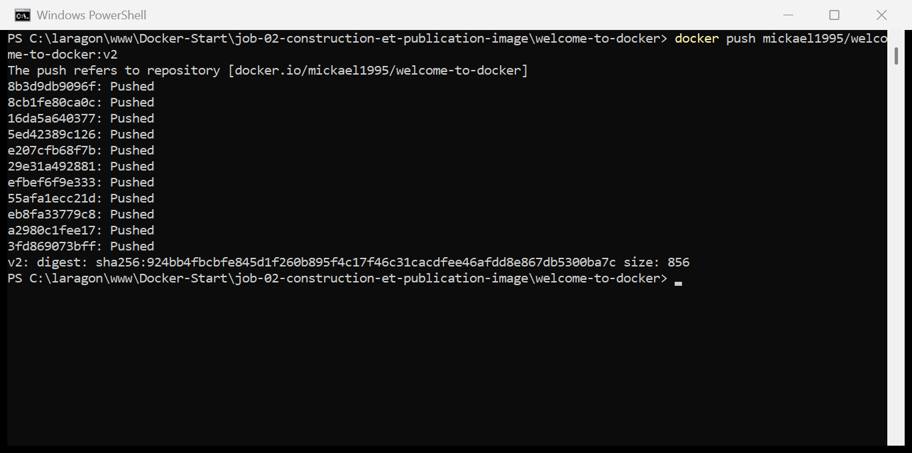

> **11 couches envoyées**, une par ligne `Pushed` — ce sont les mêmes couches que
> celles construites par le `docker build`. Le `digest` final est l'empreinte de
> l'image publiée : c'est ce que verra quiconque fera un `docker pull`.

### 11.5 — Vérification sur le Docker Hub

### 👉 https://hub.docker.com/r/mickael1995/welcome-to-docker

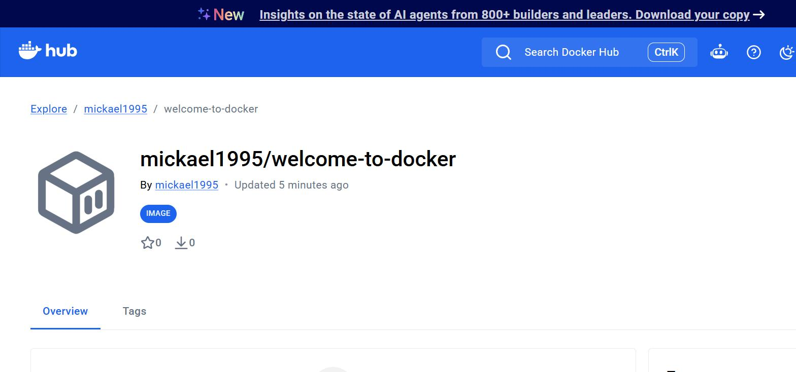

> L'image est **publique** : n'importe qui peut désormais la récupérer et la
> lancer, sans même cloner le projet ni installer Node.js :
>
> ```powershell
> docker run -d -p 8088:3000 --name welcome-mickael mickael1995/welcome-to-docker:v2
> ```
>
> C'est tout l'intérêt de Docker résumé en une commande : l'application, son
> serveur et son environnement d'exécution voyagent ensemble.
>
> **Pour un membre de la promo**, il n'y a donc rien à partager d'autre que ce
> nom : `mickael1995/welcome-to-docker:v2`.

---

## 12. Récupérer et modifier l'image d'un membre de la promo

> ℹ️ **Étape non réalisée** : aucune image publiée par un camarade n'était
> disponible au moment du rendu. La procédure est documentée ci-dessous, prête à
> être appliquée.

Mon image est en revanche publiée et **immédiatement utilisable** par n'importe
qui de la promo :

```powershell
docker pull mickael1995/welcome-to-docker:v2
docker run -d -p 8088:3000 --name welcome-mickael mickael1995/welcome-to-docker:v2
```

La marche à suivre une fois l'image d'un camarade disponible :

```powershell
# 1. Récupérer son image
docker pull <camarade>/welcome-to-docker:v2

# 2. La lancer pour voir son travail
docker run -d -p 8091:3000 --name welcome-camarade <camarade>/welcome-to-docker:v2

# 3. La modifier, la reconstruire, la republier sous mon compte
docker tag <camarade>/welcome-to-docker:v2 <utilisateur>/welcome-to-docker:remix
docker push <utilisateur>/welcome-to-docker:remix
```

> **Crédit obligatoire.** Le sujet demande de citer l'auteur de l'image
> d'origine. Le nom du camarade sera indiqué ici, et la bonne pratique est de le
> mentionner aussi **dans l'image elle-même** — via un label dans le
> Dockerfile :
>
> ```dockerfile
> LABEL org.opencontainers.image.authors="Mickael AY"
> LABEL org.opencontainers.image.source="image originale de <camarade>"
> ```
>
> Ces labels se relisent ensuite avec `docker inspect <image>`.

---

## 13. Récapitulatif des commandes

```powershell
# 1. Récupérer le projet
git clone https://github.com/docker/welcome-to-docker.git
cd welcome-to-docker

# 2. Lire la recette
cat Dockerfile
cat README.md

# 3. Construire l'image
docker build -t welcome-to-docker:v1 .
docker images welcome-to-docker

# 4. Lancer un conteneur     ->  http://localhost:8088
docker run -d -p 8088:3000 --name welcome-v1 welcome-to-docker:v1
docker ps --filter name=welcome-v1

# 5. Modifier src/App.js et src/App.css, puis vérifier
git diff --stat

# 6. Reconstruire            (le cache s'arrete a COPY ./src)
docker build -t welcome-to-docker:v2 .

# 7. Lancer la v2            ->  http://localhost:8090
docker run -d -p 8090:3000 --name welcome-v2 welcome-to-docker:v2

# 8. Publier
docker login
docker tag welcome-to-docker:v2 mickael1995/welcome-to-docker:v2
docker push mickael1995/welcome-to-docker:v2

# 9. Nettoyer
docker rm -f welcome-v1 welcome-v2
docker rmi welcome-to-docker:v1 welcome-to-docker:v2
```

---

## 14. Ce que j'ai retenu

1. **`pull` télécharge une image, `build` en fabrique une.** Même application,
   deux images totalement différentes : 22 Mo servis par nginx sur le port 80
   d'un côté, 473 Mo servis par Node.js sur le port 3000 de l'autre.

2. **Le `EXPOSE` du Dockerfile dicte le port de droite dans `-p`.** Recopier la
   commande du job précédent sans regarder le Dockerfile donne un conteneur qui
   démarre mais ne répond pas — l'erreur la plus pénible à diagnostiquer, parce
   qu'il n'y a aucun message d'erreur.

3. **Une image est figée.** Modifier le code source ne change ni l'image, ni le
   conteneur qui tourne. Il faut `build` puis **recréer** le conteneur —
   `restart` ne sert à rien ici.

4. **Le cache s'arrête à la première couche modifiée, et tout ce qui suit est
   recalculé.** D'où l'ordre des instructions dans un Dockerfile : le stable
   d'abord (`package.json`), le changeant ensuite (`src/`).

5. **Chaque instruction crée une couche**, et une couche ne s'allège jamais.
   D'où le `RUN` unique enchaîné avec `&&` pour installer *et* supprimer
   `node_modules` dans la même couche.

6. **`-v` en développement, `build` pour livrer.** Un bind mount évite de
   reconstruire à chaque modification ; c'est le confort de travail que Docker
   Compose automatise.

7. **Publier impose de retaguer** avec son nom de compte. `docker tag` ne copie
   rien, il ajoute juste un nom sur la même image — l'ID reste identique.

8. **Authentification et autorisation sont deux choses différentes.** Le
   `docker push` refusé renvoyait `insufficient_scope` alors que j'étais bien
   connecté : le compte était reconnu, mais pas autorisé à écrire dans
   `library/`.

---

## Ressources

- [docker/welcome-to-docker](https://github.com/docker/welcome-to-docker) — le projet du job
- [Référence du Dockerfile](https://docs.docker.com/reference/dockerfile/)
- [Bonnes pratiques d'écriture d'un Dockerfile](https://docs.docker.com/build/building/best-practices/)
- [Docker — cache de build](https://docs.docker.com/build/cache/)
- [Docker Hub](https://hub.docker.com/)
