# Jour 1 — Job 03 : Welcome to Docker (Part 3) — Super Mario

> Formation développeur web — **La Plateforme**
> Objectif : chercher une image sur le Docker Hub, la lancer, y jouer depuis le
> navigateur, puis faire le ménage — **en terminal et dans Docker Desktop**.

Image de travail : **`pengbai/docker-supermario`** (le sujet annonce
`pengbai/supermario`, voir §1)

---

## Sommaire

1. [Le piège du sujet : l'image annoncée n'existe pas](#1-le-piège-du-sujet--limage-annoncée-nexiste-pas)
2. [Chercher l'image](#2-chercher-limage)
3. [Récupérer l'image](#3-récupérer-limage)
4. [Lancer le conteneur sur le port 8600](#4-lancer-le-conteneur-sur-le-port-8600)
5. [Lancer un second conteneur sur un autre port](#5-lancer-un-second-conteneur-sur-un-autre-port)
6. [Accéder au jeu et y jouer](#6-accéder-au-jeu-et-y-jouer)
7. [Arrêter le conteneur par son ID](#7-arrêter-le-conteneur-par-son-id)
8. [Supprimer le conteneur](#8-supprimer-le-conteneur)
9. [Supprimer l'image](#9-supprimer-limage)
10. [Les mêmes actions dans Docker Desktop](#10-les-mêmes-actions-dans-docker-desktop)
11. [Récapitulatif des commandes](#11-récapitulatif-des-commandes)
12. [Ce que j'ai retenu](#12-ce-que-jai-retenu)

---

## 1. Le piège du sujet : l'image annoncée n'existe pas

Le sujet donne le nom `pengbai/supermario`. Première commande, première erreur :

```powershell
docker pull pengbai/supermario
```

```
Using default tag: latest
Error response from daemon: pull access denied for pengbai/supermario,
repository does not exist or may require 'docker login'
```

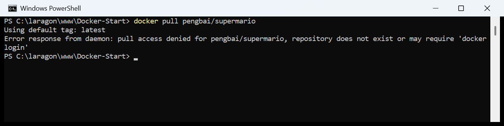

> **Analyse du message.** Il annonce deux causes possibles :
> *« repository does not exist »* **ou** *« may require docker login »*. Docker
> ne peut pas faire la différence : que le dépôt n'existe pas ou qu'il soit privé
> et inaccessible, le serveur répond la même chose. C'est **volontaire** — sinon
> on pourrait deviner l'existence de dépôts privés en testant des noms.
>
> Ici j'étais bien connecté au Docker Hub (voir le
> [Job 02](../job-02-construction-et-publication-image/README.md#11-publier-limage-sur-le-docker-hub)),
> donc la première cause est la bonne : **ce dépôt n'existe pas**.
>
> C'est précisément ce que demande le sujet : *« à vous de trouver le moyen de
> trouver l'image »*.

---

## 2. Chercher l'image

### 2.1 — Chercher par mot-clé

```powershell
docker search supermario
```

```
NAME                                      DESCRIPTION                                     STARS     OFFICIAL
bharathshetty4/supermario                 Infinite Mario game in HTML5 JavaScript, run…   4
onlinepublic/supermario                   supermario                                      1
daniellindemann/supermario                Infinite Mario game in HTML5 JavaScript, run…   0
supermario/devbox-postgresql-extensions   A devbox based Postgresql with postgis and p…   0
thtom/supermario                          Multiarch image of pengbai supermario in HTM…   0
```

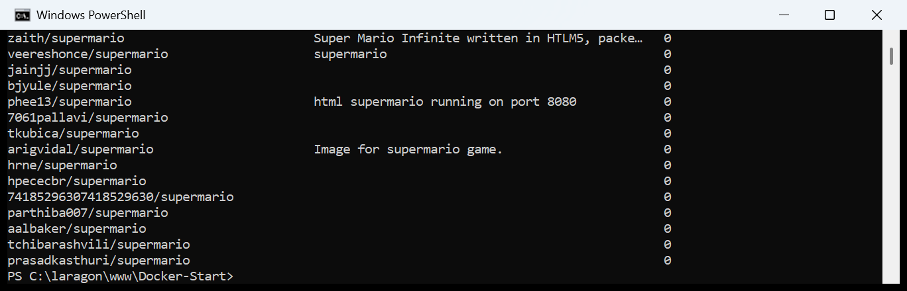

> `docker search` interroge le Docker Hub **depuis le terminal**, sans passer par
> le navigateur. Les colonnes utiles :
> - `STARS` — la popularité, un bon indicateur de fiabilité ;
> - `OFFICIAL` — un `[OK]` signale une image officielle, maintenue par Docker.
>
> Aucun `pengbai/supermario` dans la liste. En revanche, la description de
> `thtom/supermario` mentionne **« Multiarch image of pengbai supermario »** :
> l'auteur `pengbai` existe bien, c'est le nom du dépôt qui est faux.

### 2.2 — Chercher par auteur

```powershell
docker search pengbai
```

```
NAME                              DESCRIPTION                        STARS     OFFICIAL
pengbai/docker-supermario         Game Super Mario Web version       47
pengbai/docker-mkdocs             MkDocs image using mkdocs-boot…    2
pengbai/docker-mvn-j8-alpine      Maven, OpenJDK 8, Alpine           1
pengbai/docker-oracle-xe-11g-r2   oracle xe 11g r2 with sql init…    10
```

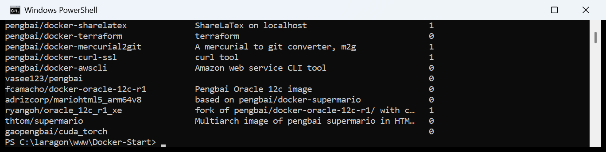

> **Trouvée.** Le vrai nom est **`pengbai/docker-supermario`** — 47 étoiles, de
> loin la plus populaire du lot. L'auteur préfixe tous ses dépôts par `docker-`,
> ce que le sujet a omis.
>
> **La méthode à retenir :** quand un nom d'image échoue, chercher **l'éditeur**
> plutôt que le produit. `docker search <auteur>` liste tous ses dépôts.

---

## 3. Récupérer l'image

```powershell
docker pull pengbai/docker-supermario
```

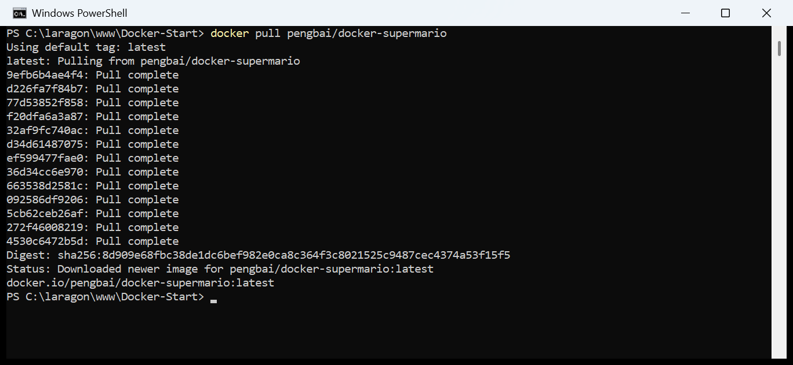

### Vérification

```powershell
docker images pengbai/docker-supermario
```

```
IMAGE                              ID             DISK USAGE   CONTENT SIZE
pengbai/docker-supermario:latest   8d909e68fbc3       1.03GB          337MB
```

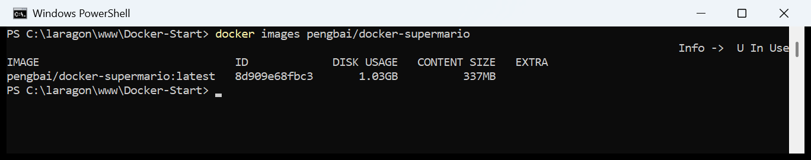

> **1,03 Go sur le disque** — c'est énorme pour un jeu en JavaScript. La raison
> apparaîtra à l'étape suivante : l'image embarque un **serveur Tomcat** complet
> avec son environnement Java.
>
> **`DISK USAGE` contre `CONTENT SIZE` :** 1,03 Go occupés sur le disque pour
> 337 Mo téléchargés. L'écart vient de la compression — les couches voyagent
> compressées et sont décompressées à l'arrivée.

---

## 4. Lancer le conteneur sur le port 8600

Le sujet demande le port **8600** côté machine, sachant que l'image est
configurée sur le **8080**, et de **conserver l'accès à l'invite de commande**.

```powershell
docker run -d -p 8600:8080 --name supermario pengbai/docker-supermario
docker ps --filter name=supermario
```

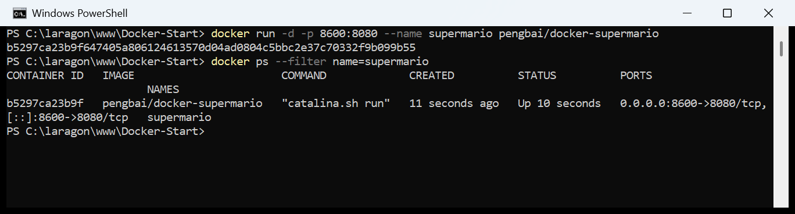

> **Les trois éléments demandés par l'énoncé :**
>
> | Consigne | Traduction |
> |---|---|
> | « assignez lui le port 8600 » | `8600` à gauche des deux-points — le port de **ma machine** |
> | « l'image est configurée sur le port 8080 » | `8080` à droite — le port **dans le conteneur** |
> | « en conservant l'accès à l'invite de commande » | **`-d`** (*detach*) — le conteneur passe en arrière-plan et le prompt revient |
>
> **Le point le plus important, c'est `-d`.** Sans lui, le terminal resterait
> attaché à la sortie du conteneur et serait bloqué, comme dans le
> [Job 02](../job-02-construction-et-publication-image/README.md#61--la-commande-exacte-du-sujet).
>
> **Et la colonne `COMMAND` révèle une surprise :** `"catalina.sh run"`.
> C'est le script de démarrage d'**Apache Tomcat**. Le jeu n'est donc pas servi
> par un petit serveur statique, mais par un serveur d'applications Java —
> d'où le port 8080 (le port par défaut de Tomcat) et le 1,03 Go de l'image.

---

## 5. Lancer un second conteneur sur un autre port

```powershell
docker run -d -p 8601:8080 --name supermario-2 pengbai/docker-supermario
docker ps --filter name=supermario
```

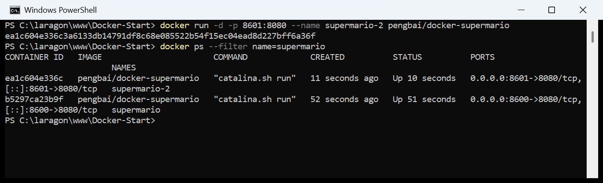

> **Deux conteneurs, une seule image.** C'est la démonstration la plus nette de
> la différence entre les deux notions : `pengbai/docker-supermario` est le
> modèle, `supermario` et `supermario-2` en sont deux instances vivantes et
> indépendantes. Chacune a son propre ID, son propre nom et son propre port.
>
> **Deux choses devaient obligatoirement changer :**
> - le **nom** (`--name`), sinon `Conflict: the container name is already in use` ;
> - le **port hôte** (`8601`), sinon `port is already allocated`.
>
> En revanche le port **interne** reste `8080` dans les deux cas : à l'intérieur
> de son conteneur, chaque Tomcat croit être seul au monde. C'est tout l'intérêt
> de l'isolation.
>
> Et l'image n'est **pas** dupliquée sur le disque : les deux conteneurs
> partagent les mêmes couches en lecture seule.

---

## 6. Accéder au jeu et y jouer

L'adresse se lit dans la colonne `PORTS` de `docker ps` : `0.0.0.0:8600->8080/tcp`.

### 👉 http://localhost:8600


> **Infinite Mario Bros**, un portage HTML5/JavaScript. L'écran-titre invite à
> appuyer sur **S** pour démarrer.

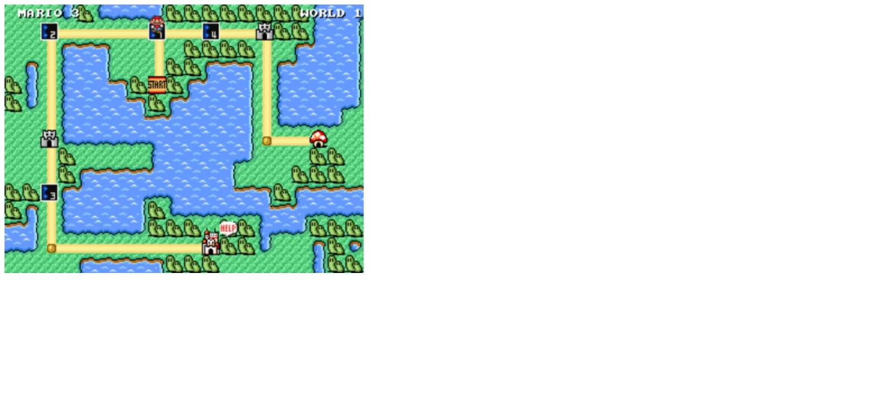

> La carte du monde 1, façon Super Mario Bros 3. Les flèches directionnelles
> déplacent le personnage d'un niveau à l'autre, **S** entre dans le niveau
> sélectionné.

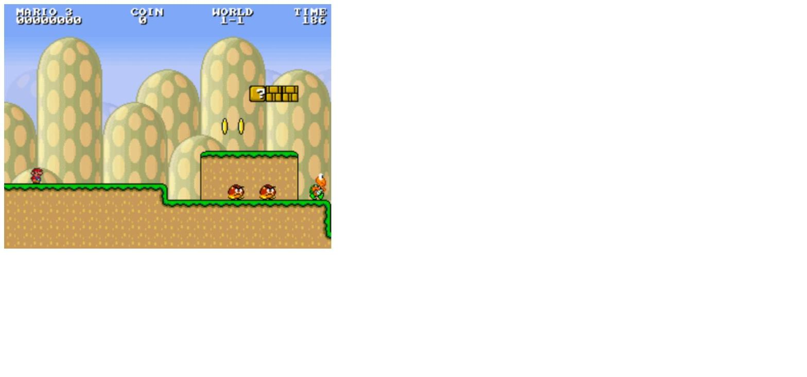

> Le niveau 1-1 : compteur de vies, de pièces, le monde en cours et le temps
> restant. Des Goombas patrouillent devant le bloc `?`.

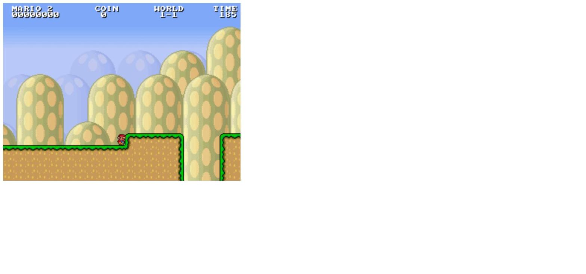

> En jeu. Commandes : **flèches** pour se déplacer, **S** pour sauter, **A**
> pour courir.

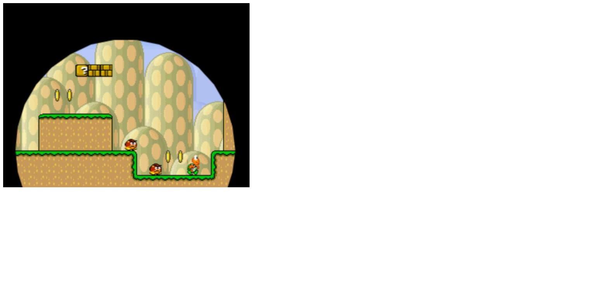

> Et l'inévitable : un Goomba mal négocié, l'écran se referme en iris, le
> compteur passe de `MARIO 3` à `MARIO 2`.

### Le second conteneur, en parallèle

### 👉 http://localhost:8601


> Deux parties totalement indépendantes tournent en même temps sur la même
> machine. Perdre une vie sur le port 8600 ne change rien sur le 8601 : ce sont
> deux conteneurs séparés, chacun avec sa propre mémoire.

---

## 7. Arrêter le conteneur par son ID

Le sujet demande **deux manières de trouver l'ID**. En voici deux en terminal ;
la troisième (Docker Desktop) est en [§10](#10-les-mêmes-actions-dans-docker-desktop).

```powershell
docker ps --filter name=supermario
docker ps -q --filter name=supermario
docker stop b5297ca23b9f
```

```
CONTAINER ID   IMAGE                       COMMAND             CREATED         STATUS         PORTS                    NAMES
ea1c604e336c   pengbai/docker-supermario   "catalina.sh run"   7 minutes ago   Up 7 minutes   0.0.0.0:8601->8080/tcp   supermario-2
b5297ca23b9f   pengbai/docker-supermario   "catalina.sh run"   8 minutes ago   Up 8 minutes   0.0.0.0:8600->8080/tcp   supermario

ea1c604e336c
b5297ca23b9f

b5297ca23b9f
```

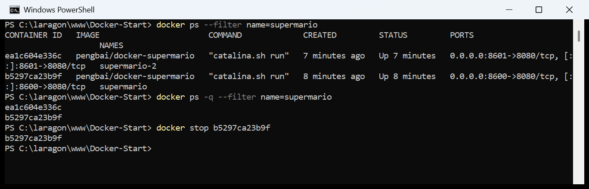

> **Méthode 1 — `docker ps`** : l'ID est dans la première colonne, au milieu de
> toutes les autres informations.
>
> **Méthode 2 — `docker ps -q`** : l'option `-q` (*quiet*) n'affiche **que** les
> IDs, un par ligne. C'est la forme utilisée dans les scripts, parce qu'elle
> s'enchaîne directement : `docker stop $(docker ps -q)` arrête tout.
>
> Docker renvoie l'ID arrêté (`b5297ca23b9f`) en confirmation. Les 12 caractères
> affichés suffisent — c'est un préfixe de l'identifiant complet sur 64
> caractères, et Docker accepte n'importe quel préfixe non ambigu.

---

## 8. Supprimer le conteneur

```powershell
docker rm b5297ca23b9f
docker ps -a --filter name=supermario
```

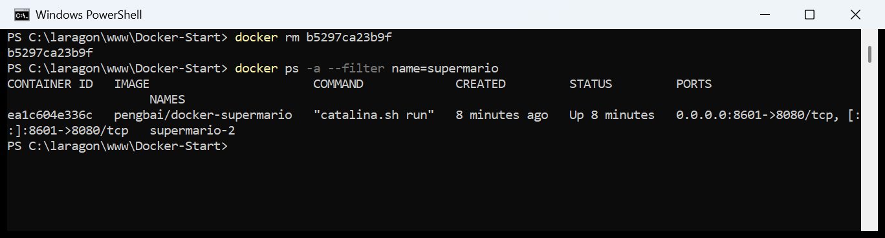

> `docker rm` sur un conteneur **arrêté** fonctionne directement. Pour un
> conteneur qui tourne encore, il faut soit l'arrêter d'abord, soit forcer avec
> `docker rm -f` — c'est ce que j'ai fait pour `supermario-2` à l'étape suivante.
>
> Après suppression, seul `supermario-2` reste dans la liste.

---

## 9. Supprimer l'image

```powershell
docker rmi pengbai/docker-supermario
```

```
Error response from daemon: conflict: unable to delete pengbai/docker-supermario:latest
(must be forced) - container ea1c604e336c is using its referenced image 8d909e68fbc3
```

```powershell
docker rm -f supermario-2
docker rmi pengbai/docker-supermario
```

```
supermario-2
Untagged: pengbai/docker-supermario:latest
Deleted: sha256:8d909e68fbc38de1dc6bef982e0ca8c364f3c8021525c9487cec4374a53f15f5
```

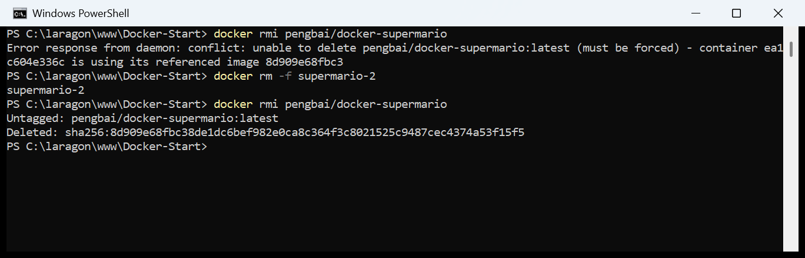

> **Le conflit était attendu :** le second conteneur tournait encore et
> dépendait de l'image. Docker refuse, et donne l'ID du responsable
> (`ea1c604e336c`).
>
> **`docker rm -f`** combine `stop` et `rm` en une seule commande — pratique
> quand on sait ce qu'on fait.
>
> Une fois plus aucun conteneur ne la référence, la suppression passe :
> `Untagged:` retire le nom, `Deleted:` efface réellement les 1,03 Go du disque.

---

## 10. Les mêmes actions dans Docker Desktop

> 🚧 **Section à compléter** — captures de l'interface graphique à ajouter.

Le sujet demande de refaire chaque action dans l'interface. Voici où se trouve
chaque élément.

### Le terminal intégré

En **bas à droite** de la fenêtre Docker Desktop, l'icône **`>_`**. Elle ouvre un
terminal ancré dans l'application, dans lequel toutes les commandes de ce rendu
fonctionnent à l'identique — c'est le même moteur Docker derrière.

> **L'intérêt réel de ce terminal intégré**, c'est de voir l'interface réagir en
> direct au-dessus : un `docker run` fait apparaître la ligne dans l'onglet
> *Containers* immédiatement, un `docker rmi` fait disparaître l'image de
> l'onglet *Images*. C'est ce que l'énoncé appelle
> *« observer ce qui s'est passé dans votre fenêtre au-dessus »*.

### Correspondance interface ↔ terminal

| Action | Terminal | Docker Desktop |
|---|---|---|
| Voir les images | `docker images` | Menu gauche → **Images** |
| Télécharger une image | `docker pull <image>` | Barre de recherche en haut → nom de l'image → **Pull** |
| Lancer un conteneur | `docker run -d -p 8600:8080 ...` | Onglet **Images** → bouton **▶ Run** → *Optional settings* → renseigner **Host port** = `8600` |
| Trouver l'ID | `docker ps` ou `docker ps -q` | Onglet **Containers**, colonne **Container ID** |
| Arrêter | `docker stop <ID>` | Onglet **Containers** → bouton **■** (carré) |
| Supprimer un conteneur | `docker rm <ID>` | Onglet **Containers** → icône **🗑 corbeille** |
| Supprimer une image | `docker rmi <image>` | Onglet **Images** → icône **🗑 corbeille** |

> **Le piège du bouton Run.** Cliquer directement sur **▶ Run** lance le
> conteneur **sans aucune redirection de port** — le jeu serait alors
> inaccessible depuis le navigateur. Il faut impérativement déplier
> ***Optional settings*** et renseigner le **Host port** (`8600`) avant de
> valider. C'est exactement l'équivalent graphique du `-p 8600:8080`, et
> l'oublier est l'erreur la plus fréquente sur cet exercice.
>
> **Deuxième différence à connaître :** Docker Desktop lance toujours en mode
> détaché. Il n'y a pas d'équivalent graphique au `-it` — pour ça, il faut
> passer par l'onglet *Exec* du conteneur une fois qu'il tourne.

---

## 11. Récapitulatif des commandes

```powershell
# 1. Chercher l'image
docker search supermario
docker search pengbai

# 2. La récupérer
docker pull pengbai/docker-supermario
docker images pengbai/docker-supermario

# 3. Lancer deux conteneurs sur deux ports differents
docker run -d -p 8600:8080 --name supermario   pengbai/docker-supermario
docker run -d -p 8601:8080 --name supermario-2 pengbai/docker-supermario
docker ps --filter name=supermario

# 4. Jouer     ->  http://localhost:8600  et  http://localhost:8601

# 5. Trouver l'ID (deux facons) puis arreter
docker ps --filter name=supermario      # ID dans la 1re colonne
docker ps -q --filter name=supermario   # uniquement les ID
docker stop b5297ca23b9f

# 6. Supprimer le conteneur
docker rm b5297ca23b9f

# 7. Supprimer l'image (apres avoir libere le 2e conteneur)
docker rm -f supermario-2
docker rmi pengbai/docker-supermario
```

---

## 12. Ce que j'ai retenu

1. **Un nom d'image faux ne se distingue pas d'un dépôt privé.** Le message
   `repository does not exist or may require 'docker login'` couvre les deux cas
   volontairement, pour ne pas révéler l'existence de dépôts privés.

2. **`docker search` cherche aussi par auteur.** Quand le nom du produit ne donne
   rien, chercher l'éditeur : `docker search pengbai` a résolu le problème en une
   commande.

3. **`-d` est ce que le sujet appelle « conserver l'accès à l'invite de
   commande ».** Sans lui, le terminal reste prisonnier du conteneur.

4. **Une image, autant de conteneurs qu'on veut.** Deux Mario tournaient en
   parallèle sur 8600 et 8601, à partir d'une seule image et sans la dupliquer
   sur le disque. Seuls le nom et le port hôte devaient différer.

5. **La colonne `COMMAND` renseigne sur le contenu d'une image.**
   `"catalina.sh run"` a révélé un Tomcat, ce qui explique à la fois le port 8080
   et le 1,03 Go — sans avoir besoin d'ouvrir le Dockerfile.

6. **`docker ps -q` est la forme scriptable.** Elle ne sort que les IDs et
   s'enchaîne : `docker stop $(docker ps -q)`.

7. **L'interface graphique cache les options.** Le bouton *Run* de Docker Desktop
   ne mappe aucun port par défaut ; il faut ouvrir *Optional settings*. En
   terminal, l'oubli du `-p` est visible dans la commande — dans l'interface,
   il est invisible.

---

## Ressources

- [pengbai/docker-supermario sur le Docker Hub](https://hub.docker.com/r/pengbai/docker-supermario)
- [Documentation `docker search`](https://docs.docker.com/reference/cli/docker/search/)
- [Documentation `docker run`](https://docs.docker.com/reference/cli/docker/container/run/)
- [Docker Desktop](https://docs.docker.com/desktop/)
