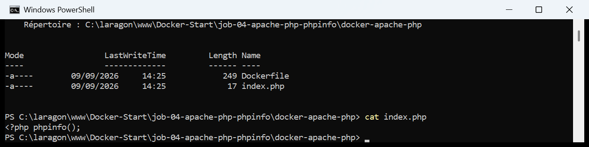
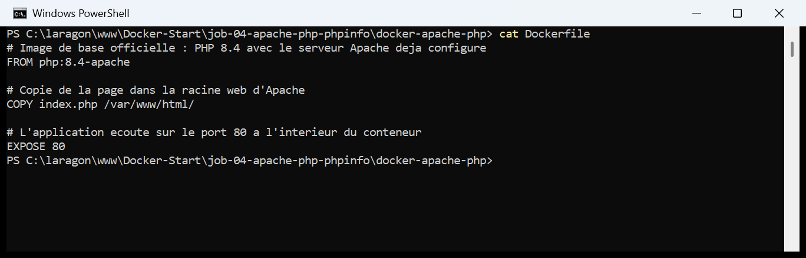
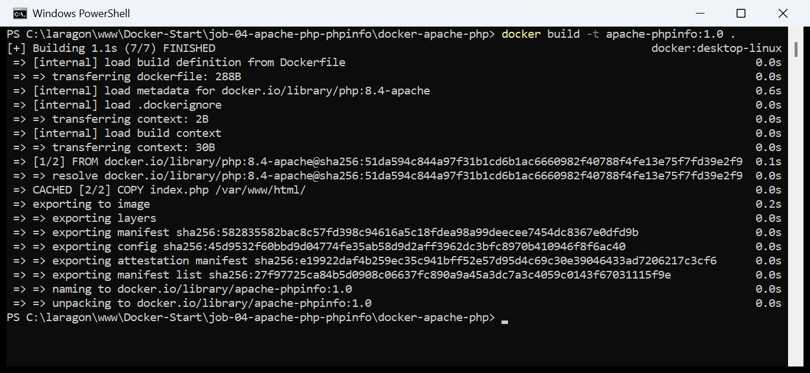
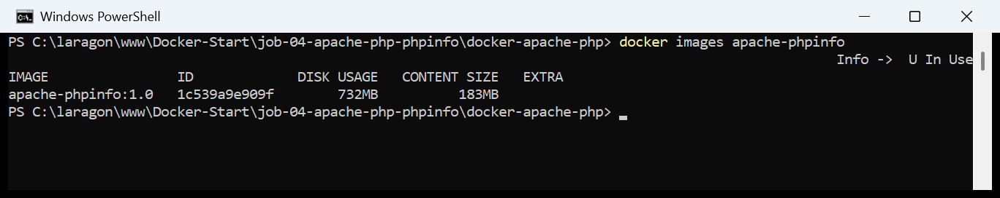
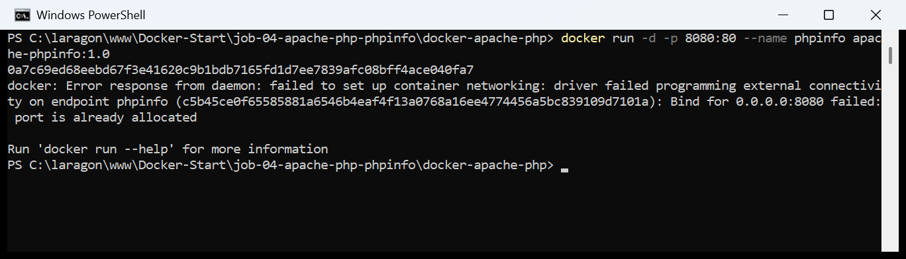
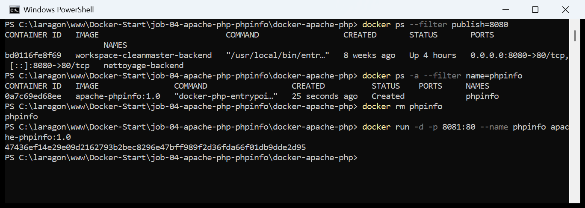
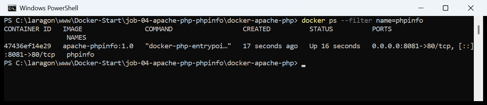
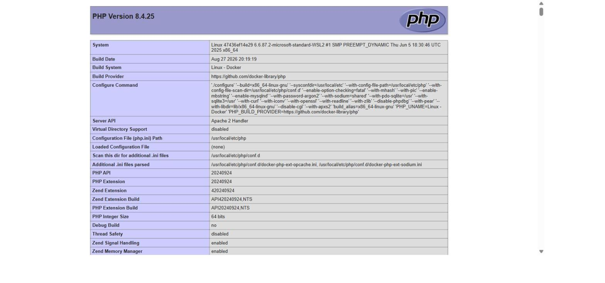
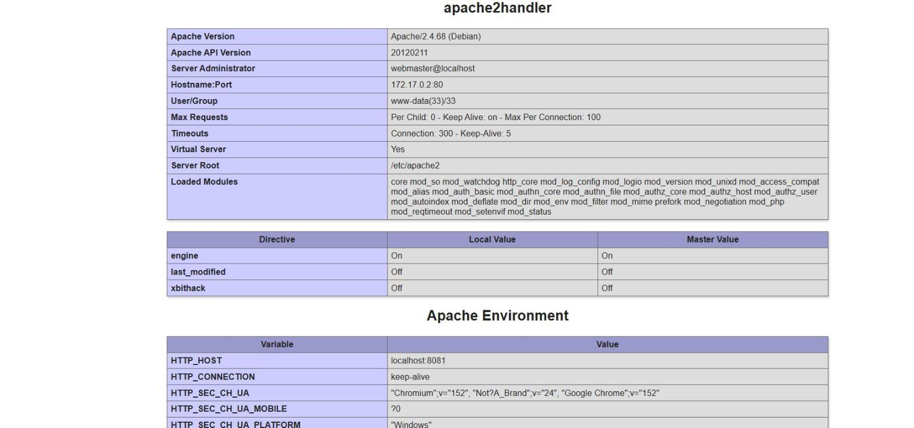
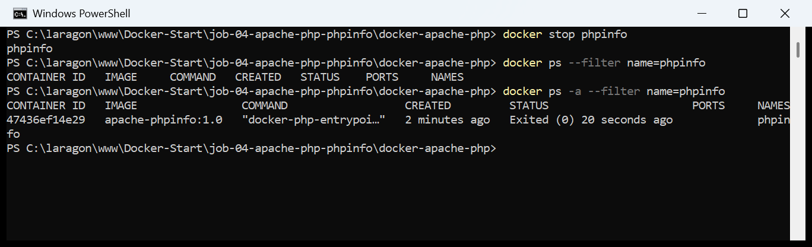

# Jour 2 — Job 04 : Docker Apache — Tout savoir sur le serveur avec `phpinfo()`

> Formation développeur web — **La Plateforme**
> Objectif : écrire un `Dockerfile` qui fabrique un environnement **Apache + PHP**,
> et y servir une page affichant les informations du serveur.

---

## Sommaire

1. [Ce que demande le sujet](#1-ce-que-demande-le-sujet)
2. [La page `index.php`](#2-la-page-indexphp)
3. [Le Dockerfile](#3-le-dockerfile)
4. [Construire l'image](#4-construire-limage)
5. [Lancer le conteneur — et l'erreur de port](#5-lancer-le-conteneur--et-lerreur-de-port)
6. [Le résultat dans le navigateur](#6-le-résultat-dans-le-navigateur)
7. [Arrêter le conteneur](#7-arrêter-le-conteneur)
8. [Récapitulatif des commandes](#8-récapitulatif-des-commandes)
9. [Ce que j'ai retenu](#9-ce-que-jai-retenu)

---

## 1. Ce que demande le sujet

| Consigne | Traduction technique |
|---|---|
| « un fichier `index.php` affichant les info sur le serveur » | La fonction PHP `phpinfo()` |
| « une commande qui ne fait que **10 caractères** » | `phpinfo();` — exactement 10 caractères, l'indice du sujet |
| « un dockerfile qui générera un environnement apache » | Une image de base `php:*-apache` |
| « Application sur le port 80 » | `EXPOSE 80` — le port **dans** le conteneur |
| « exposer sur le port 8080 » | `-p 8080:80` au `docker run` — le port **de la machine** |

### L'arborescence du projet

```
docker-apache-php/
├── Dockerfile      <- la recette de l'image
└── index.php       <- la page servie
```

Deux fichiers, c'est tout.

---

## 2. La page `index.php`

```php
<?php phpinfo();
```



> **`phpinfo()` fait exactement 10 caractères avec ses parenthèses et son
> point-virgule** — c'est l'indice donné par le sujet, et il ne laisse aucune
> ambiguïté sur la fonction attendue.
>
> Elle génère à elle seule une page HTML complète contenant toute la
> configuration du serveur : version de PHP, version d'Apache, modules chargés,
> variables d'environnement, directives du `php.ini`…
>
> **Pas de balise fermante `?>`** : c'est volontaire et c'est la
> [recommandation officielle de PHP](https://www.php.net/manual/fr/language.basic-syntax.instruction-separation.php)
> pour un fichier qui ne contient que du PHP. Elle évite qu'un espace ou un
> retour à la ligne traînant après la balise ne soit envoyé au navigateur et ne
> casse les en-têtes HTTP.
>
> ⚠️ **En production, cette page ne doit jamais être accessible.** Elle révèle
> les versions exactes de PHP et d'Apache, les chemins du serveur et les modules
> installés — une carte détaillée pour qui cherche une faille connue. C'est un
> outil de diagnostic, à supprimer une fois le diagnostic fait.

---

## 3. Le Dockerfile

```dockerfile
# Image de base officielle : PHP 8.4 avec le serveur Apache deja configure
FROM php:8.4-apache

# Copie de la page dans la racine web d'Apache
COPY index.php /var/www/html/

# L'application ecoute sur le port 80 a l'interieur du conteneur
EXPOSE 80
```



> **Trois lignes suffisent**, et c'est tout l'intérêt de l'exercice.
>
> | Instruction | Rôle |
> |---|---|
> | `FROM php:8.4-apache` | Récupère une image officielle où **Apache et PHP sont déjà installés et reliés entre eux**. Le suffixe `-apache` est ce qui distingue cette variante de `php:8.4-cli` (PHP en ligne de commande, sans serveur web) ou `php:8.4-fpm` (PHP-FPM, à coupler avec un nginx séparé). |
> | `COPY index.php /var/www/html/` | `/var/www/html` est la **racine web d'Apache** sur Debian, celle que l'image configure par défaut. Y déposer un `index.php` suffit à ce qu'il soit servi à la racine du site. |
> | `EXPOSE 80` | **Documente** le port d'écoute. C'est le « Application sur le port 80 » du sujet. |
>
> **Le piège classique — `EXPOSE` n'ouvre rien.** C'est une simple déclaration
> d'intention, lisible par `docker inspect`. Sans `-p` au lancement, le
> conteneur tournerait parfaitement mais resterait injoignable depuis le
> navigateur. C'est le `-p 8080:80` de l'étape 5 qui perce réellement le
> passage.
>
> **Pourquoi ne pas partir d'une image `apache` seule ?** Parce qu'il faudrait
> ensuite installer PHP, le module `mod_php`, et les relier à la main —
> plusieurs `RUN apt-get`. L'image `php:8.4-apache` fait déjà tout ça,
> correctement et de façon reproductible. **Choisir la bonne image de base, c'est
> la moitié du travail d'un Dockerfile.**

---

## 4. Construire l'image

```powershell
docker build -t apache-phpinfo:1.0 .
```



> La capture montre une construction **avec le cache déjà chaud** : l'étape
> `COPY index.php` est marquée `CACHED`. Lors du tout premier build, Docker a
> d'abord dû **télécharger l'image de base** `php:8.4-apache` — une quinzaine de
> couches à extraire, ce qui a pris l'essentiel du temps.
>
> À noter dans la sortie : `transferring context: 30B`. Le contexte envoyé au
> moteur ne pèse que 30 octets, parce que le dossier ne contient que l'`index.php`
> et le `Dockerfile`. À comparer aux 709 ko du
> [Job 02](../job-02-construction-et-publication-image/README.md#5-construire-limage-docker-build) —
> un contexte léger, c'est un build rapide.

### Vérification

```powershell
docker images apache-phpinfo
```



---

## 5. Lancer le conteneur — et l'erreur de port

### 5.1 — La commande du sujet échoue

Le sujet demande d'exposer sur le port **8080** :

```powershell
docker run -d -p 8080:80 --name phpinfo apache-phpinfo:1.0
```

```
docker: Error response from daemon: failed to set up container networking:
driver failed programming external connectivity on endpoint phpinfo:
Bind for 0.0.0.0:8080 failed: port is already allocated
```



> **Analyse :** le port 8080 de ma machine est **déjà utilisé par un autre
> conteneur**, issu d'un projet précédent. Un port ne peut être écouté que par un
> seul programme à la fois — c'est une règle du système d'exploitation, pas une
> limite de Docker.

### 5.2 — Diagnostic et correction

```powershell
docker ps --filter publish=8080
docker ps -a --filter name=phpinfo
docker rm phpinfo
docker run -d -p 8081:80 --name phpinfo apache-phpinfo:1.0
```

```
CONTAINER ID   IMAGE                           COMMAND                  STATUS       PORTS                    NAMES
bd0116fe8f69   workspace-cleanmaster-backend   "/usr/local/bin/entr…"   Up 4 hours   0.0.0.0:8080->80/tcp     nettoyage-backend

CONTAINER ID   IMAGE                COMMAND                   CREATED          STATUS    PORTS   NAMES
0a7c69ed68ee   apache-phpinfo:1.0   "docker-php-entrypoi…"    25 seconds ago   Created           phpinfo

phpinfo
47436ef14e29e09d2162793b2bec8296e47bff989f2d36fda66f01db9dde2d95
```



> **Cette capture contient trois enseignements.**
>
> **1. `--filter publish=8080` identifie le coupable.** Plutôt que de lire toute
> la liste des conteneurs, ce filtre ne garde que ceux qui publient ce port. Ici :
> `nettoyage-backend`, un conteneur d'un autre projet qui tourne depuis 4 heures.
>
> **2. Le conteneur raté existe quand même, au statut `Created`.** C'est le point
> le plus contre-intuitif : `docker run` a échoué, mais il avait **déjà créé** le
> conteneur avant de tenter d'ouvrir le port. Il reste donc là, jamais démarré,
> et surtout **il réserve le nom `phpinfo`**. Relancer la commande telle quelle
> donnerait alors une *deuxième* erreur, complètement différente :
> `Conflict. The container name "/phpinfo" is already in use`.
>
> D'où le `docker rm phpinfo` **avant** de relancer. C'est l'erreur en cascade
> classique : on corrige le port, et on se heurte à un conflit de nom qu'on ne
> comprend pas parce que `docker ps` (sans `-a`) ne montre rien.
>
> **3. Le port hôte est un choix libre.** Je suis passé sur **8081**, en laissant
> intact le port 80 côté conteneur. Le sujet demandait 8080 — je documente
> pourquoi ce n'était pas possible ici. Les trois autres solutions auraient été :
> arrêter `nettoyage-backend` (hors de question, c'est un autre projet), le
> reconfigurer, ou choisir n'importe quel autre port libre.

### 5.3 — Le conteneur tourne

```powershell
docker ps --filter name=phpinfo
```



---

## 6. Le résultat dans le navigateur

### 👉 http://localhost:8081



> **PHP 8.4.25**, et la ligne qui compte pour ce job :
> **`Server API : Apache 2.0 Handler`**. Elle confirme que PHP n'est pas exécuté
> en ligne de commande mais **par Apache**, via le module `mod_php` — exactement
> l'environnement demandé.
>
> On lit aussi `System : Linux ... microsoft-standard-WSL2` : le conteneur tourne
> bien dans la machine virtuelle Linux de Docker Desktop, pas sur Windows.

### La section Apache



> **C'est la capture la plus intéressante du job**, parce qu'elle montre la
> redirection de port **des deux côtés à la fois** :
>
> | Ligne | Valeur | Ce que ça dit |
> |---|---|---|
> | `Hostname:Port` | `172.17.0.2:80` | Vu **de l'intérieur** : Apache écoute sur le port **80**, à l'adresse privée du conteneur sur le réseau Docker |
> | `HTTP_HOST` | `localhost:8081` | Vu **de l'extérieur** : ce que le navigateur a demandé, sur le port **8081** |
>
> C'est la démonstration concrète du `-p 8081:80` : Apache n'a aucune idée qu'il
> est joint sur le 8081. Dans son monde, il écoute sur le 80 comme n'importe quel
> serveur web, et c'est Docker qui fait la traduction.
>
> Les autres informations utiles : **Apache/2.4.68 (Debian)**, l'utilisateur
> `www-data` sous lequel tourne le serveur, la racine `/etc/apache2`, et la liste
> des modules chargés — dont `mod_php`, celui qui permet à Apache d'interpréter
> le PHP.

---

## 7. Arrêter le conteneur

```powershell
docker stop phpinfo
docker ps --filter name=phpinfo
docker ps -a --filter name=phpinfo
```



> `docker ps` ne renvoie plus rien, mais `docker ps -a` montre toujours le
> conteneur au statut `Exited (0)` — arrêt propre. Il n'est pas supprimé : il
> peut être relancé tel quel avec `docker start phpinfo`.
>
> Le sujet s'arrête à « stopper le ». Pour un nettoyage complet il faudrait
> ensuite `docker rm phpinfo` puis `docker rmi apache-phpinfo:1.0`.

---

## 8. Récapitulatif des commandes

```powershell
# 1. Se placer dans le dossier du projet
cd docker-apache-php

# 2. Construire l'image
docker build -t apache-phpinfo:1.0 .
docker images apache-phpinfo

# 3. Lancer le conteneur
#    -p 8080:80 echoue si le port 8080 est deja pris : basculer sur 8081
docker run -d -p 8081:80 --name phpinfo apache-phpinfo:1.0
docker ps --filter name=phpinfo

# 4. Consulter     ->  http://localhost:8081

# 5. Arreter
docker stop phpinfo
docker ps -a --filter name=phpinfo

# 6. Nettoyer completement (facultatif)
docker rm phpinfo
docker rmi apache-phpinfo:1.0

# Utile en cas de conflit de port
docker ps --filter publish=8080     # qui occupe le port ?
```

---

## 9. Ce que j'ai retenu

1. **L'image de base fait 90 % du travail.** `php:8.4-apache` livre Apache et PHP
   déjà reliés ; le Dockerfile tient en trois lignes. Partir d'une image `apache`
   nue aurait demandé plusieurs `RUN apt-get` et beaucoup plus d'occasions de se
   tromper.

2. **`EXPOSE` documente, `-p` ouvre.** Les deux sont nécessaires et ne font pas
   la même chose. `EXPOSE 80` dit « l'application écoute là », `-p 8081:80`
   branche réellement un port de la machine dessus.

3. **Un `docker run` qui échoue laisse quand même un conteneur derrière lui.**
   Au statut `Created`, invisible dans `docker ps`, mais il réserve le nom. Il
   faut le supprimer avant de relancer, sinon on enchaîne sur une erreur de
   conflit de nom sans comprendre d'où elle vient.

4. **`docker ps --filter publish=<port>` répond à « qui occupe mon port ? ».**
   Bien plus direct que de parcourir toute la liste.

5. **`phpinfo()` prouve la redirection de port de l'intérieur.** `Hostname:Port`
   affiche `172.17.0.2:80` alors que `HTTP_HOST` affiche `localhost:8081` : le
   serveur ignore totalement le port par lequel on l'a joint.

6. **Le port de l'énoncé n'est pas toujours disponible.** Savoir diagnostiquer le
   conflit et choisir un autre port fait partie du travail — le port hôte est
   arbitraire, seul le port interne est imposé par l'application.

---

## Ressources

- [Image officielle `php` sur le Docker Hub](https://hub.docker.com/_/php)
- [`phpinfo()` — documentation PHP](https://www.php.net/manual/fr/function.phpinfo.php)
- [phpinfo expliqué — Kinsta](https://kinsta.com/fr/base-de-connaissances/phpinfo/)
- [Référence du Dockerfile](https://docs.docker.com/reference/dockerfile/)
