# Jour 3 — Job 05 : Tic Tac Toe — Docker et volumes

> Formation développeur web — **La Plateforme**
> Objectif : héberger un jeu de morpion dans un conteneur Nginx, et rendre les
> résultats des parties **persistants** grâce à un volume Docker nommé.

---

## Sommaire

1. [Le problème que pose le sujet](#1-le-problème-que-pose-le-sujet)
2. [Les fichiers du projet](#2-les-fichiers-du-projet)
3. [Le Dockerfile](#3-le-dockerfile)
4. [La configuration Nginx](#4-la-configuration-nginx)
5. [Construire l'image](#5-construire-limage)
6. [Créer le volume et vérifier sa création](#6-créer-le-volume-et-vérifier-sa-création)
7. [Lancer le conteneur avec le volume](#7-lancer-le-conteneur-avec-le-volume)
8. [Jouer plusieurs parties](#8-jouer-plusieurs-parties)
9. [Afficher le contenu du conteneur et du volume](#9-afficher-le-contenu-du-conteneur-et-du-volume)
10. [Le résultat des parties](#10-le-résultat-des-parties)
11. [La preuve de la persistance](#11-la-preuve-de-la-persistance)
12. [Arrêter le conteneur](#12-arrêter-le-conteneur)
13. [Les mêmes actions dans Docker Desktop](#13-les-mêmes-actions-dans-docker-desktop)
14. [Récapitulatif des commandes](#14-récapitulatif-des-commandes)
15. [Ce que j'ai retenu](#15-ce-que-jai-retenu)

---

## 1. Le problème que pose le sujet

Avant d'écrire la moindre ligne, il y a une contradiction à résoudre dans
l'énoncé :

| Consigne | Problème |
|---|---|
| « Utilisez une image Docker basée sur **Nginx** » | Nginx est un serveur de fichiers **statiques** |
| Le fichier `save.php` fourni en annexe | …est du **PHP**, que Nginx ne sait pas exécuter |

**Nginx seul ne peut pas faire tourner `save.php`.** Contrairement à Apache qui
embarque `mod_php` (c'est ce qu'on a utilisé au
[Job 04](../job-04-apache-php-phpinfo/README.md)), Nginx n'a aucun interpréteur
PHP intégré. Il délègue à un processus séparé, **PHP-FPM**, via le protocole
FastCGI.

**Deuxième détail à repérer**, dans le JavaScript de l'annexe :

```javascript
const response = await fetch('/save', { method: 'POST', ... });
```

Le jeu appelle **`/save`**, pas `/save.php`. Et le fichier n'est même pas dans la
racine web : le sujet demande qu'il vive **dans le volume**. Il faut donc une
règle de routage dans Nginx.

**La solution retenue** — respecter la consigne à la lettre :

```
Navigateur ──/save──► Nginx ──FastCGI──► PHP-FPM ──► /var/www/game-results/save.php
                        │                                        │
                   index.html                            results.json
                (dans l'image)                         (dans le volume)
```

L'image part bien de `nginx:alpine`, et PHP-FPM y est ajouté pour le seul
`save.php`.

---

## 2. Les fichiers du projet

```powershell
ls
```

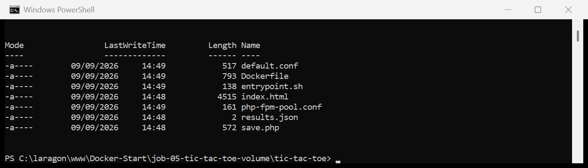

| Fichier | Rôle | Destination |
|---|---|---|
| `index.html` | Le jeu (annexe du sujet) | Racine web de Nginx, **dans l'image** |
| `save.php` | Enregistre le gagnant (annexe du sujet) | **Dans le volume** |
| `results.json` | Le fichier de résultats, initialisé à `[]` | **Dans le volume** |
| `Dockerfile` | La recette de l'image | — |
| `default.conf` | Configuration Nginx : sert le jeu et route `/save` | Dans l'image |
| `php-fpm-pool.conf` | Configuration du pool PHP-FPM | Dans l'image |
| `entrypoint.sh` | Démarre PHP-FPM puis Nginx | Dans l'image |

> Les trois fichiers de l'annexe sont repris **tels quels**. Le sujet précise
> d'ailleurs que « l'objectif n'est pas une question de code ». Les quatre
> autres fichiers sont l'infrastructure Docker, c'est-à-dire le travail demandé.

---

## 3. Le Dockerfile

```dockerfile
# Image de base imposee par le sujet : Nginx
FROM nginx:alpine

# Nginx ne sait pas executer de PHP : on lui adjoint PHP-FPM
RUN apk add --no-cache php84 php84-fpm

# La page du jeu, servie par Nginx depuis sa racine web
COPY index.html /usr/share/nginx/html/

# Configuration de Nginx et du pool PHP-FPM
COPY default.conf       /etc/nginx/conf.d/default.conf
COPY php-fpm-pool.conf  /etc/php84/php-fpm.d/zz-docker.conf
COPY entrypoint.sh      /entrypoint.sh

# Les deux fichiers destines au volume : c'est le Dockerfile qui les y depose
COPY save.php results.json /var/www/game-results/

RUN chmod +x /entrypoint.sh \
    && chown -R nginx:nginx /var/www/game-results

# Point de montage prevu pour le volume nomme game-results
VOLUME /var/www/game-results

EXPOSE 80

CMD ["/entrypoint.sh"]
```

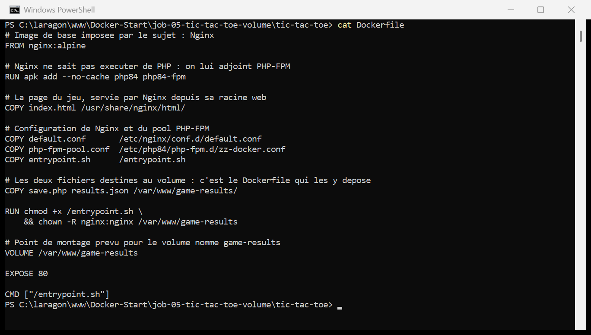

> **La ligne la plus importante du job :**
>
> ```dockerfile
> COPY save.php results.json /var/www/game-results/
> ```
>
> Le sujet précise « **C'est Dockerfile qui les copiera dedans** », et c'est ce
> qui rend l'astuce possible. Ce dossier n'a rien de spécial au moment du build :
> c'est un dossier ordinaire de l'image. Il ne devient un volume qu'au
> lancement, avec `-v`.
>
> **Pourquoi `chown -R nginx:nginx` ?** PHP-FPM tourne sous l'utilisateur
> `nginx` (voir `php-fpm-pool.conf`). Sans ce changement de propriétaire,
> `file_put_contents()` échouerait en écriture et aucune partie ne serait
> enregistrée — une erreur silencieuse, car le JavaScript ne vérifie pas la
> réponse.
>
> **`VOLUME /var/www/game-results`** déclare le point de montage. Attention à
> bien comprendre la nuance : cette instruction ne crée pas le volume `game-results`.
> Elle indique juste que ce dossier est destiné à en accueillir un. Sans `-v` au
> lancement, Docker créerait un volume **anonyme** — persistant lui aussi, mais
> avec un nom illisible et impossible à retrouver.
>
> **Et `entrypoint.sh` ?** Un conteneur n'exécute qu'**un seul** processus
> principal. Ici il en faut deux : PHP-FPM et Nginx. Le script lance PHP-FPM en
> arrière-plan (`--daemonize`) puis passe la main à Nginx avec `exec`, pour que
> Nginx devienne le PID 1 du conteneur et reçoive correctement les signaux
> d'arrêt.

---

## 4. La configuration Nginx

```nginx
server {
    listen 80;
    server_name localhost;

    root /usr/share/nginx/html;
    index index.html;

    location / {
        try_files $uri $uri/ =404;
    }

    # Le jeu appelle fetch('/save') : on route cette URL vers save.php,
    # qui se trouve dans le volume et non dans la racine web.
    location = /save {
        fastcgi_pass 127.0.0.1:9000;
        fastcgi_param SCRIPT_FILENAME /var/www/game-results/save.php;
        include fastcgi_params;
    }
}
```

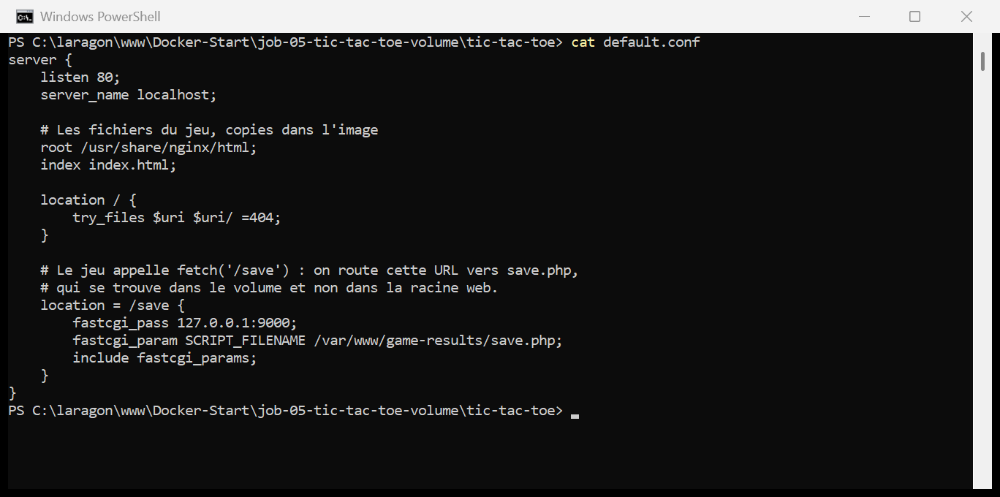

> **`location = /save`** — le signe `=` impose une correspondance **exacte** avec
> l'URL. C'est ce bloc qui fait le lien entre le `fetch('/save')` du JavaScript
> et le fichier `save.php`.
>
> **`fastcgi_pass 127.0.0.1:9000`** — Nginx transmet la requête à PHP-FPM, qui
> écoute sur ce port **à l'intérieur du conteneur**. Ce port n'est jamais exposé
> vers l'extérieur : seul le 80 l'est.
>
> **`fastcgi_param SCRIPT_FILENAME /var/www/game-results/save.php`** — on désigne
> explicitement le script à exécuter, en dehors de la racine web. C'est ce qui
> permet à `save.php` de vivre dans le volume plutôt que dans l'image.
>
> Et comme `save.php` utilise `__DIR__ . '/results.json'`, il écrit forcément
> **à côté de lui**, donc dans le volume lui aussi. Les deux fichiers voyagent
> ensemble, exactement comme le demande le sujet.

---

## 5. Construire l'image

```powershell
docker build -t tic-tac-toe:1.0 .
```

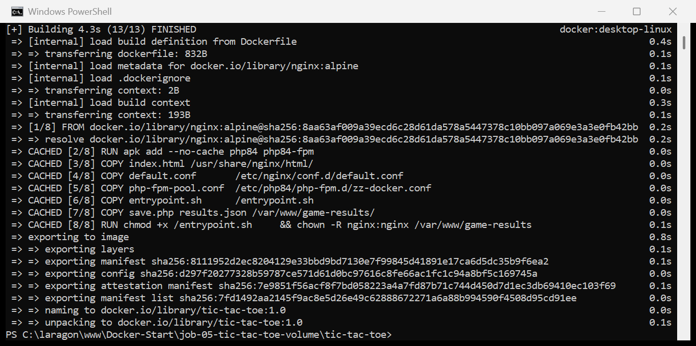

---

## 6. Créer le volume et vérifier sa création

> *« Trouver la commande Docker qui permet de vérifier que la création du volume
> est effective »*

```powershell
docker volume create game-results
docker volume ls
```

```
game-results

DRIVER    VOLUME NAME
local     4beee90e4e84bdd3930edbf33c7ce45606125b555c32b0ae091ba31cdfbfe035
local     06c1d77928548944e13e712b38cd47934923353fbdfbe31a525ce4a5abd72ec7
...
local     game-results
```

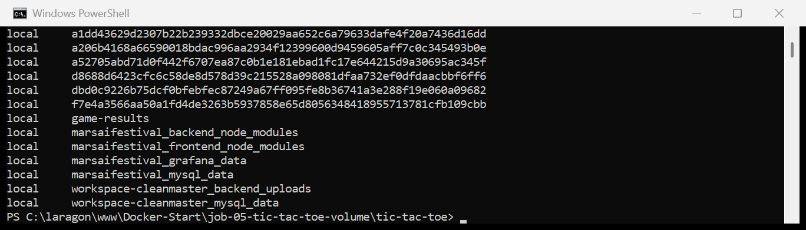

> **`docker volume ls`** est la réponse à la question du sujet : elle liste tous
> les volumes et confirme la présence de `game-results`.
>
> On remarque au passage plusieurs volumes aux noms illisibles, faits de 64
> caractères hexadécimaux : ce sont des volumes **anonymes**, créés
> automatiquement par des images qui déclarent un `VOLUME` sans qu'on leur
> fournisse de nom. D'où l'intérêt de `docker volume create <nom>` : un volume
> nommé se retrouve, se sauvegarde et se supprime facilement.

### Le détail : `docker volume inspect`

```powershell
docker volume inspect game-results
```

```json
[
    {
        "CreatedAt": "2026-09-09T12:52:54Z",
        "Driver": "local",
        "Labels": null,
        "Mountpoint": "/var/lib/docker/volumes/game-results/_data",
        "Name": "game-results",
        "Options": null,
        "Scope": "local"
    }
]
```

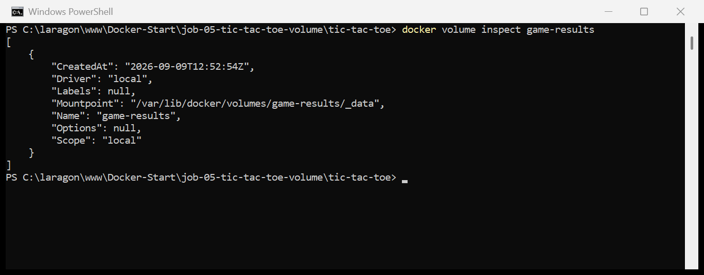

> **`Mountpoint`** donne l'emplacement réel des données :
> `/var/lib/docker/volumes/game-results/_data`.
>
> ⚠️ Sous Windows, ce chemin **n'existe pas** sur le disque C: — il se trouve
> à l'intérieur de la machine virtuelle Linux de Docker Desktop (WSL 2). On ne
> peut donc pas y accéder avec l'explorateur de fichiers : il faut passer par un
> conteneur, comme à l'étape 9.
>
> **`Driver: local`** signifie que les données sont stockées sur cette machine.
> D'autres pilotes existent pour stocker un volume sur un NFS ou dans le cloud.

---

## 7. Lancer le conteneur avec le volume

```powershell
docker run -d -p 8082:80 -v game-results:/var/www/game-results --name morpion tic-tac-toe:1.0
docker ps --filter name=morpion
```

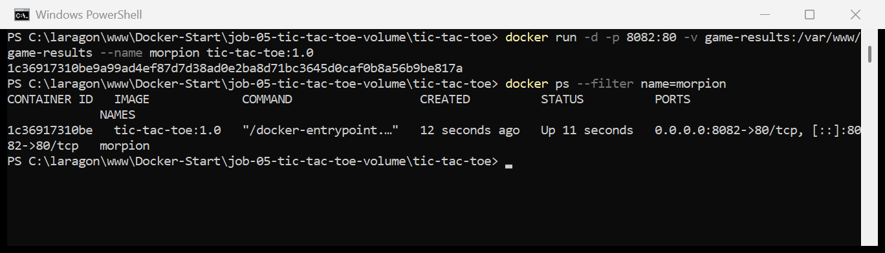

> **`-v game-results:/var/www/game-results`** relie le volume nommé au dossier
> du conteneur. La syntaxe se lit comme celle de `-p` :
> `nom_du_volume:chemin_dans_le_conteneur`.
>
> **Le port :** le sujet demande le **8080**, mais il est occupé sur ma machine
> par un conteneur d'un autre projet — le même conflit qu'au
> [Job 04](../job-04-apache-php-phpinfo/README.md#5-lancer-le-conteneur--et-lerreur-de-port),
> où l'erreur `port is already allocated` est capturée en détail. J'utilise donc
> le **8082**. Le port interne reste bien le **80**, comme demandé.

### Le volume a été pré-rempli par le Dockerfile

```powershell
docker exec morpion ls -la /var/www/game-results
```

```
total 16
drwxr-xr-x    2 nginx    nginx         4096 Sep  9 12:53 .
drwxr-xr-x    1 root     root          4096 Sep  9 12:49 ..
-rwxr-xr-x    1 nginx    nginx            2 Sep  9 12:48 results.json
-rwxr-xr-x    1 nginx    nginx          572 Sep  9 12:48 save.php
```

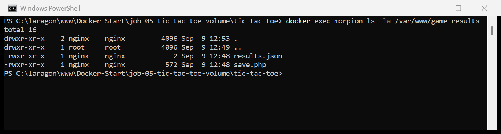

> **C'est le mécanisme central du job, et il n'a rien d'évident.**
>
> Le volume `game-results` venait d'être créé, donc **vide**. Pourtant il
> contient déjà `save.php` (572 octets) et `results.json` (2 octets, soit `[]`).
>
> **Pourquoi ?** Quand Docker monte un volume **nommé et vide** sur un dossier
> qui contient déjà des fichiers dans l'image, il **recopie le contenu de
> l'image dans le volume** au premier montage. C'est exactement ce que voulait
> dire le sujet avec « C'est Dockerfile qui les copiera dedans ».
>
> ⚠️ **Ce comportement ne vaut que la première fois, et uniquement pour un
> volume vide.** Si le volume contient déjà quelque chose, son contenu **masque**
> celui de l'image. Conséquence concrète : modifier `save.php` et reconstruire
> l'image ne suffirait pas — il faudrait supprimer le volume pour que la nouvelle
> version y soit recopiée.
>
> ⚠️ Et attention, **un bind mount (`-v C:\chemin:/dossier`) ne fait pas ça** :
> il masque toujours le contenu de l'image, même s'il est vide. Cette recopie
> automatique est une spécificité des volumes nommés.

---

## 8. Jouer plusieurs parties

### 👉 http://localhost:8082


> Le jeu s'affiche : la grille 3×3, l'indication du joueur courant et le bouton
> *Réinitialiser*. À ce stade, `results.json` contient toujours `[]`.

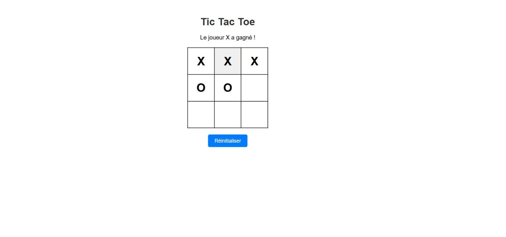

> **Partie 1 — X gagne** en alignant la ligne du haut. Le statut passe à
> « Le joueur X a gagné ! », et le JavaScript déclenche
> `saveResults('X')` → un POST vers `/save`.

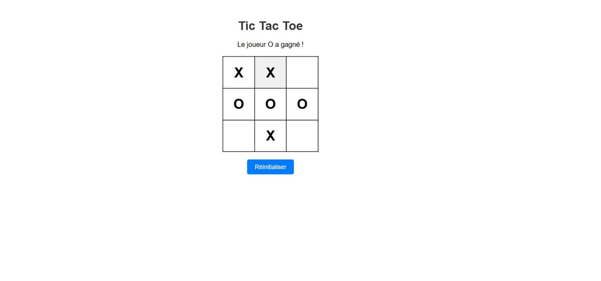

> **Partie 2 — O gagne** la ligne du milieu, après un *Réinitialiser*.

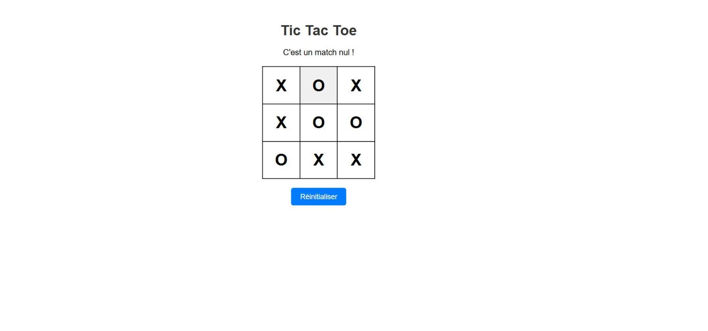

> **Partie 3 — match nul.** La grille est pleine sans alignement, et le code
> enregistre alors `saveResults('Draw')`. Les trois issues possibles du jeu sont
> couvertes.
>
> J'ai enchaîné **5 parties au total** pour remplir le fichier de résultats.

---

## 9. Afficher le contenu du conteneur et du volume

> *« Trouver la commande qui affiche le contenu du container »*
> *« Trouver la commande qui affiche le contenu du volume »*

### Le contenu du conteneur

```powershell
docker exec morpion ls -la /usr/share/nginx/html
docker exec morpion ls -la /var/www/game-results
```

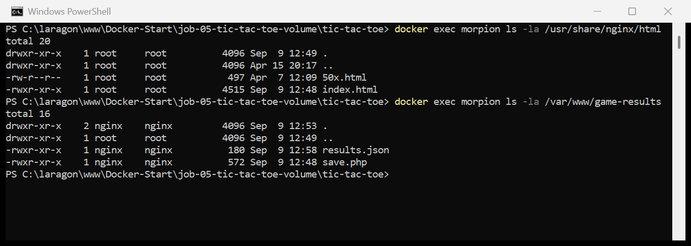

> **`docker exec <conteneur> <commande>`** exécute une commande **à l'intérieur**
> d'un conteneur qui tourne. C'est la réponse à la question du sujet.
>
> Les deux dossiers montrent bien la séparation :
> - `/usr/share/nginx/html` → `index.html`, qui vient de **l'image** ;
> - `/var/www/game-results` → `save.php` et `results.json`, qui viennent du
>   **volume**.
>
> **Variante interactive :** `docker exec -it morpion sh` ouvre un shell dans le
> conteneur et permet de s'y promener librement. `exit` pour en sortir — le
> conteneur continue de tourner.

### Le contenu du volume, sans le conteneur du jeu

```powershell
docker run --rm -v game-results:/data alpine ls -la /data
```

```
total 16
drwxr-xr-x    2 101      101           4096 Sep  9 12:53 .
drwxr-xr-x    1 root     root          4096 Sep  9 13:01 ..
-rwxr-xr-x    1 101      101            180 Sep  9 12:58 results.json
-rwxr-xr-x    1 101      101            572 Sep  9 12:48 save.php
```

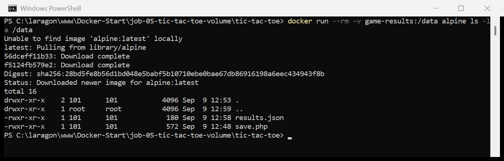

> **C'est la vraie réponse à « afficher le contenu du volume ».** La commande
> précédente inspectait le volume *à travers* le conteneur du jeu ; celle-ci
> l'ouvre **indépendamment**, en montant le volume dans un conteneur Alpine
> jetable.
>
> **Décomposition :**
> - `--rm` — le conteneur est supprimé dès la commande terminée ;
> - `-v game-results:/data` — le volume est monté sur `/data` ;
> - `alpine` — une image minuscule (~7 Mo) qui sert juste de boîte à outils ;
> - `ls -la /data` — la commande à exécuter.
>
> **C'est la technique standard pour inspecter, sauvegarder ou restaurer un
> volume** sans dépendre de l'application qui l'utilise. On la retrouve dans
> toutes les procédures de sauvegarde Docker.
>
> **À noter :** `results.json` fait maintenant **180 octets** au lieu de 2. Les
> parties ont bien été écrites. Le propriétaire s'affiche en `101` — c'est
> l'**UID** de l'utilisateur `nginx` dans l'image du jeu ; Alpine ne connaît pas
> ce nom, il montre donc le numéro brut.

---

## 10. Le résultat des parties

> *« Afficher le contenu de results.json avec une commande »*

```powershell
docker exec morpion cat /var/www/game-results/results.json
```

```json
[
    {
        "winner": "X"
    },
    {
        "winner": "O"
    },
    {
        "winner": "Draw"
    },
    {
        "winner": "X"
    },
    {
        "winner": "O"
    }
]
```

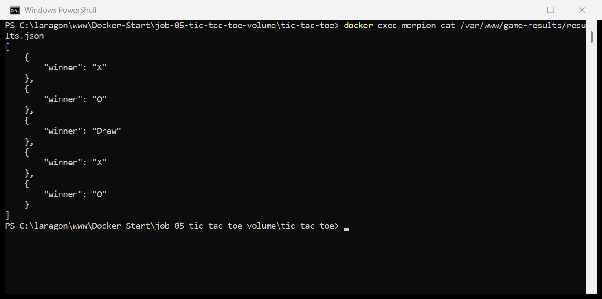

> **Les 5 parties sont enregistrées**, dans l'ordre où elles ont été jouées :
> deux victoires de X, deux de O et un match nul.
>
> La chaîne complète est vérifiée de bout en bout : un clic dans le navigateur →
> `fetch('/save')` → Nginx → PHP-FPM → `save.php` → écriture dans `results.json`
> **à l'intérieur du volume**.
>
> Le format vient du `JSON_PRETTY_PRINT` de `save.php`, et chaque entrée du
> tableau correspond à l'objet `{ winner }` envoyé par le JavaScript.

---

## 11. La preuve de la persistance

C'est la raison d'être de tout le job. Je **détruis** le conteneur, j'en crée un
nouveau, et je relis le fichier :

```powershell
docker rm -f morpion
docker run -d -p 8082:80 -v game-results:/var/www/game-results --name morpion tic-tac-toe:1.0
docker exec morpion cat /var/www/game-results/results.json
```

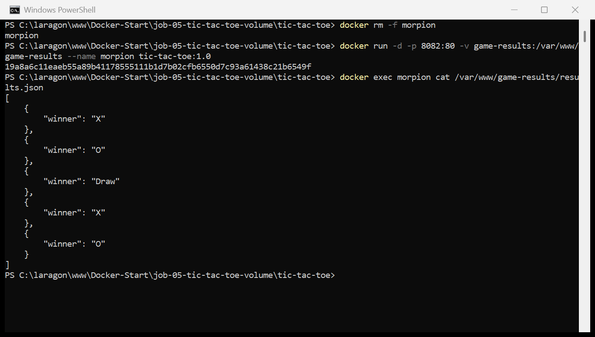

> **Les 5 parties sont toujours là**, dans un conteneur qui n'existait pas
> quand elles ont été jouées.
>
> **C'est toute la différence entre un conteneur et un volume :**
>
> | | Conteneur | Volume |
> |---|---|---|
> | Durée de vie | Jetable, recréé à volonté | Survit aux conteneurs |
> | Contenu | L'application | Les **données** |
> | Supprimé par | `docker rm` | `docker volume rm` |
>
> Sans le volume, le `docker rm -f` aurait effacé les résultats définitivement —
> exactement ce qui arriverait à une base de données mal configurée.
>
> **C'est le réflexe à garder :** tout ce qu'une application écrit et qui doit
> survivre à une mise à jour doit vivre dans un volume. Le conteneur, lui, doit
> pouvoir être détruit et recréé sans conséquence.

---

## 12. Arrêter le conteneur

```powershell
docker stop morpion
docker ps -a --filter name=morpion
```

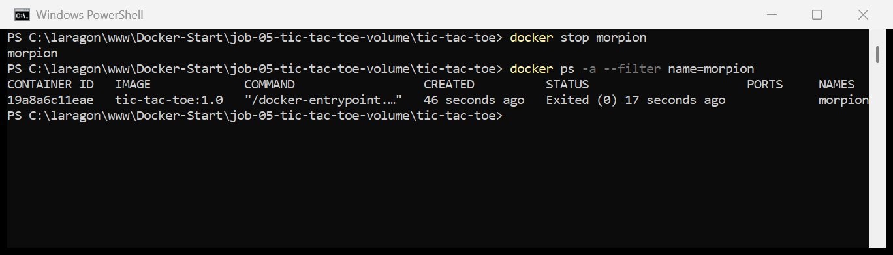

> Le conteneur passe en `Exited (0)`. Le volume `game-results`, lui, reste
> intact — `docker volume ls` le montrerait toujours.

---

## 13. Les mêmes actions dans Docker Desktop

> 🚧 **Section à compléter** — captures de l'interface graphique à ajouter.

Le sujet demande de retrouver ces actions dans l'interface. Voici où elles se
trouvent.

| Action | Terminal | Docker Desktop |
|---|---|---|
| Lister les volumes | `docker volume ls` | Menu gauche → **Volumes** |
| Détail d'un volume | `docker volume inspect game-results` | **Volumes** → clic sur `game-results` |
| Contenu du volume | `docker run --rm -v game-results:/data alpine ls -la /data` | **Volumes** → `game-results` → onglet **Stored data** |
| Lire `results.json` | `docker exec morpion cat .../results.json` | **Volumes** → **Stored data** → clic sur le fichier |
| Contenu du conteneur | `docker exec morpion ls -la /...` | **Containers** → `morpion` → onglet **Files** |
| Shell dans le conteneur | `docker exec -it morpion sh` | **Containers** → `morpion` → onglet **Exec** |

> **L'onglet *Files* d'un conteneur** est le plus pratique des deux : il affiche
> l'arborescence complète du conteneur, et un double-clic ouvre le fichier
> directement dans l'interface. C'est le moyen le plus rapide de lire
> `results.json` sans taper une seule commande.
>
> Les dossiers montés depuis un volume y sont d'ailleurs signalés par une icône
> différente — on voit d'un coup d'œil ce qui est persistant et ce qui ne l'est
> pas.

---

## 14. Récapitulatif des commandes

```powershell
# 1. Construire l'image
cd tic-tac-toe
docker build -t tic-tac-toe:1.0 .

# 2. Creer le volume et verifier
docker volume create game-results
docker volume ls
docker volume inspect game-results

# 3. Lancer le conteneur en liant le volume
docker run -d -p 8082:80 -v game-results:/var/www/game-results --name morpion tic-tac-toe:1.0
docker ps --filter name=morpion

# 4. Jouer     ->  http://localhost:8082

# 5. Afficher le contenu du conteneur
docker exec morpion ls -la /usr/share/nginx/html
docker exec morpion ls -la /var/www/game-results
docker exec -it morpion sh          # shell interactif

# 6. Afficher le contenu du volume, sans le conteneur du jeu
docker run --rm -v game-results:/data alpine ls -la /data

# 7. Lire les resultats
docker exec morpion cat /var/www/game-results/results.json

# 8. Prouver la persistance
docker rm -f morpion
docker run -d -p 8082:80 -v game-results:/var/www/game-results --name morpion tic-tac-toe:1.0
docker exec morpion cat /var/www/game-results/results.json    # les parties sont toujours la

# 9. Arreter
docker stop morpion

# 10. Nettoyer completement (efface AUSSI les resultats)
docker rm morpion
docker volume rm game-results
docker rmi tic-tac-toe:1.0
```

---

## 15. Ce que j'ai retenu

1. **Nginx ne sait pas exécuter de PHP.** Il faut lui adjoindre PHP-FPM et les
   relier en FastCGI. C'est la différence de fond avec `php:apache` du Job 04,
   où `mod_php` fait le travail tout seul.

2. **Un volume nommé et vide se remplit tout seul au premier montage** avec ce
   que contient l'image à cet emplacement. C'est ce qui permet au Dockerfile
   d'« installer » `save.php` et `results.json` dans le volume. Mais ça ne se
   produit **qu'une fois** : ensuite, le volume masque l'image.

3. **Volume nommé ≠ bind mount.** Le bind mount masque toujours le contenu de
   l'image, même vide. La recopie automatique est propre aux volumes nommés.

4. **`VOLUME` dans le Dockerfile ne crée pas de volume nommé.** Il déclare un
   point de montage ; sans `-v`, Docker crée un volume anonyme au nom illisible.

5. **Pour inspecter un volume, on monte un conteneur jetable dessus :**
   `docker run --rm -v <volume>:/data alpine ls -la /data`. C'est la technique
   standard, indépendante de l'application, qui sert aussi aux sauvegardes.

6. **Un conteneur n'exécute qu'un processus principal.** Pour en faire tourner
   deux, il faut un script de démarrage — et terminer par `exec` pour que le
   processus principal soit bien le PID 1 et reçoive les signaux d'arrêt.

7. **Les permissions sont un piège silencieux.** Sans `chown` sur le dossier du
   volume, PHP n'aurait pas pu écrire, et le jeu aurait fonctionné en apparence
   sans rien enregistrer.

8. **Le conteneur est jetable, le volume ne l'est pas.** `docker rm -f` détruit
   le conteneur sans toucher aux données. C'est ce qui rend les mises à jour
   d'application sans risque pour la base.

---

## Ressources

- [Docker — Volumes](https://docs.docker.com/engine/storage/volumes/)
- [Docker — Sauvegarder et restaurer un volume](https://docs.docker.com/engine/storage/volumes/#back-up-restore-or-migrate-data-volumes)
- [Image officielle `nginx`](https://hub.docker.com/_/nginx)
- [Nginx — module FastCGI](https://nginx.org/en/docs/http/ngx_http_fastcgi_module.html)
- [Référence du Dockerfile](https://docs.docker.com/reference/dockerfile/)
