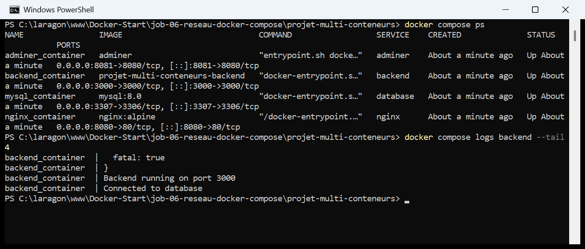
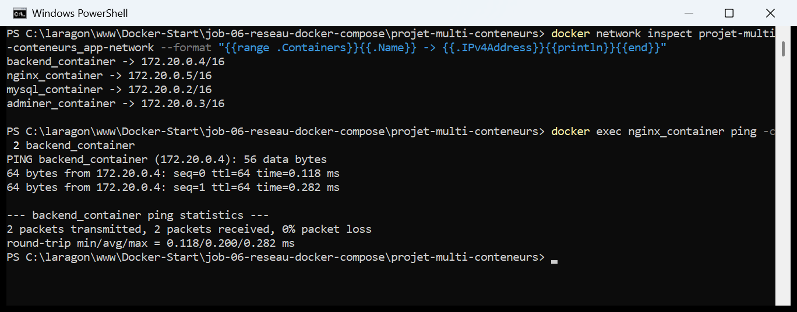
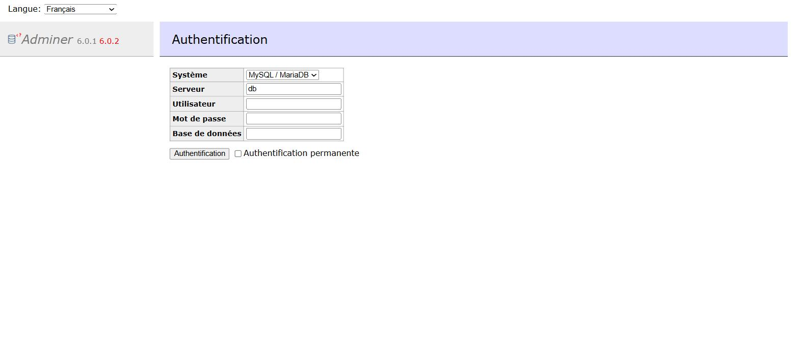
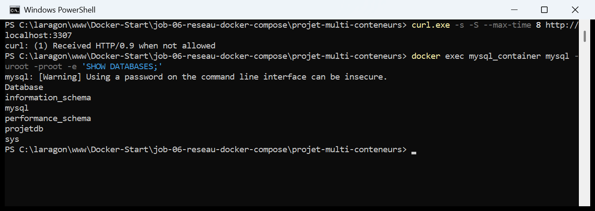
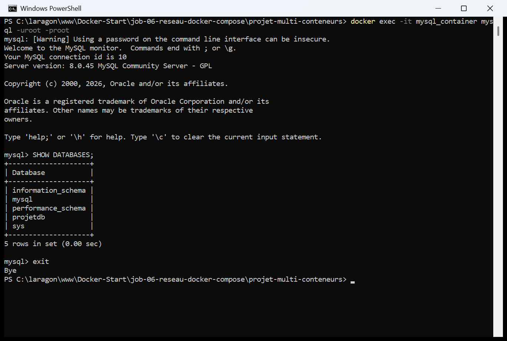

# Jour 4 — Job 06 : Réseautage — application multi-conteneurs avec Docker Compose

> Formation développeur web — **La Plateforme**
> Objectif : déployer **quatre services** en un seul `docker compose up`, les
> faire communiquer entre eux par le réseau Docker, et administrer la base de
> données depuis une interface graphique.

---

## Sommaire

1. [L'architecture](#1-larchitecture)
2. [Les fichiers du projet](#2-les-fichiers-du-projet)
3. [Le `docker-compose.yml`](#3-le-docker-composeyml)
4. [Le Dockerfile du backend](#4-le-dockerfile-du-backend)
5. [Démarrer la pile](#5-démarrer-la-pile)
6. [Le réseau : comment les conteneurs se trouvent](#6-le-réseau--comment-les-conteneurs-se-trouvent)
7. [Le frontend et la chaîne complète](#7-le-frontend-et-la-chaîne-complète)
8. [Adminer](#8-adminer)
9. [MySQL n'est pas un serveur web](#9-mysql-nest-pas-un-serveur-web)
10. [Récapitulatif des commandes](#10-récapitulatif-des-commandes)
11. [Ce que j'ai retenu](#11-ce-que-jai-retenu)

---

## 1. L'architecture

```
                  Navigateur
                       │
      ┌────────────────┼────────────────┐
      │ :8080          │ :3000          │ :8081
      ▼                ▼                ▼
 ┌─────────┐      ┌─────────┐      ┌─────────┐
 │  nginx  │      │ backend │      │ adminer │
 │ (alpine)│      │(node 16)│      │         │
 └────┬────┘      └────┬────┘      └────┬────┘
      │  /api/  ───────┘                │
      │   proxy_pass                    │
      │                                 │
      └──────────► ┌──────────┐ ◄───────┘
                   │ database │
                   │ mysql 8  │
                   └────┬─────┘
                        │
                   ┌────▼─────┐
                   │ db-data  │  volume nomme
                   └──────────┘

        Tous sur le meme reseau : app-network
```

| Service | Image | Port hôte | Port interne | Rôle |
|---|---|---|---|---|
| `database` | `mysql:8.0` | `3307` | `3306` | La base `projetdb` |
| `backend` | construite (`node:16-alpine`) | `3000` | `3000` | L'API Express |
| `nginx` | `nginx:alpine` | `8080` | `80` | Sert le frontend, relaie `/api/` |
| `adminer` | `adminer` | `8081` | `8080` | Administration graphique de la base |

> **Deux écarts avec l'énoncé, tous deux dus à des ports déjà occupés sur ma
> machine :**
>
> - **MySQL est publié sur `3307`** au lieu de `3306`, ce port étant pris par un
>   autre serveur en dehors de Docker. Sans conséquence : le backend joint la
>   base sur le **réseau interne**, en `mysql_container:3306`, sans passer par
>   le port publié.
> - **Le port `8080`** était occupé par un conteneur d'un autre projet, que j'ai
>   arrêté le temps de l'exercice. Il était indispensable de le libérer :
>   le `index.html` de l'annexe appelle `http://localhost:8080/api/status`
>   **en dur**.

---

## 2. Les fichiers du projet

```
projet-multi-conteneurs/
├── docker-compose.yml        <- l'orchestration des 4 services
├── backend/
│   ├── Dockerfile            <- environnement Node.js
│   ├── server.js             <- l'API (annexe du sujet)
│   └── package.json          <- express + mysql2
├── frontend/
│   └── index.html            <- la page (annexe du sujet)
└── nginx/
    └── nginx.conf            <- configuration du proxy (annexe du sujet)
```

> Ni `database` ni `adminer` n'ont de dossier : ces deux services utilisent des
> images officielles **telles quelles**, entièrement configurées depuis le
> `docker-compose.yml`. C'est ce que précise l'énoncé.

---

## 3. Le `docker-compose.yml`

```yaml
services:

  database:
    image: mysql:8.0
    container_name: mysql_container       # nom attendu par server.js (DB_HOST)
    environment:
      MYSQL_ROOT_PASSWORD: root
      MYSQL_DATABASE: projetdb
    ports:
      - "3307:3306"
    volumes:
      - db-data:/var/lib/mysql
    networks:
      - app-network

  backend:
    build: ./backend
    container_name: backend_container     # nom attendu par nginx.conf
    environment:
      DB_HOST: mysql_container
      DB_USER: root
      DB_PASSWORD: root
      DB_NAME: projetdb
    ports:
      - "3000:3000"
    depends_on:
      - database
    networks:
      - app-network

  nginx:
    image: nginx:alpine
    container_name: nginx_container
    ports:
      - "8080:80"
    volumes:
      - ./frontend:/usr/share/nginx/html:ro
      - ./nginx/nginx.conf:/etc/nginx/conf.d/default.conf:ro
    depends_on:
      - backend
    networks:
      - app-network

  adminer:
    image: adminer
    container_name: adminer_container
    ports:
      - "8081:8080"
    depends_on:
      - database
    networks:
      - app-network

networks:
  app-network:
    driver: bridge

volumes:
  db-data:
```

> **Les `container_name` ne sont pas décoratifs.** Deux fichiers de l'annexe
> codent des noms en dur, et la pile ne démarrerait pas sans eux :
>
> | Fichier de l'annexe | Nom attendu |
> |---|---|
> | `server.js` → `DB_HOST \|\| 'mysql_container'` | `mysql_container` |
> | `nginx.conf` → `proxy_pass http://backend_container:3000` | `backend_container` |
>
> **`depends_on` gère l'ordre de démarrage, pas la disponibilité.** Docker lance
> `database` avant `backend`, mais n'attend pas que MySQL soit *prêt à accepter
> des connexions* — l'initialisation prend une dizaine de secondes. C'est
> précisément pourquoi le `server.js` de l'annexe contient une boucle de
> reconnexion toutes les 5 secondes. On voit d'ailleurs l'échec puis la réussite
> dans les logs (capture ci-dessous).
>
> **Le volume `db-data`** rend la base persistante : `docker compose down` peut
> détruire les conteneurs, les données restent. Même principe qu'au
> [Job 05](../job-05-tic-tac-toe-volume/README.md).
>
> **Les montages `:ro`** (*read-only*) sur le frontend et la config Nginx sont un
> réflexe de sécurité : le conteneur ne doit pas pouvoir modifier mes fichiers
> sources. Ils permettent aussi de modifier `index.html` sans reconstruire quoi
> que ce soit — un simple rafraîchissement du navigateur suffit.

---

## 4. Le Dockerfile du backend

```dockerfile
FROM node:16-alpine

WORKDIR /app

# Les dependances d'abord : cette couche reste en cache tant que
# package.json ne change pas, meme si server.js est modifie
COPY package*.json ./
RUN npm install --omit=dev

COPY server.js .

EXPOSE 3000

CMD ["node", "server.js"]
```

> C'est le seul service **construit** ; les trois autres partent d'images
> officielles. L'ordre des instructions applique la leçon du
> [Job 02](../job-02-construction-et-publication-image/README.md#8-reconstruire-limage-et-voir-le-cache-travailler) :
> le `package.json` (stable) avant le `server.js` (changeant), pour que
> `npm install` reste en cache quand seul le code bouge.

---

## 5. Démarrer la pile

```powershell
docker compose up -d --build
docker compose ps
docker compose logs backend --tail 4
```



> **Une seule commande démarre les quatre services**, crée le réseau et le
> volume. C'est tout l'intérêt de Compose face à quatre `docker run` séparés,
> chacun avec ses options de réseau et de volume.
>
> - `-d` — en arrière-plan ;
> - `--build` — reconstruit l'image du backend si son code a changé.
>
> **Les logs racontent le démarrage :** on y lit d'abord une erreur de connexion
> à la base, puis `Backend running on port 3000` et enfin
> **`Connected to database`**. C'est la boucle de reconnexion de `server.js` qui
> a fait son travail pendant que MySQL finissait de s'initialiser. Sans elle, le
> backend serait mort au démarrage.
>
> **Commandes utiles :** `docker compose logs -f <service>` suit les logs en
> direct, `docker compose down` arrête et supprime tout (en gardant les
> volumes), `docker compose restart <service>` redémarre un seul service.

---

## 6. Le réseau : comment les conteneurs se trouvent

C'est le cœur du job.

```powershell
docker network inspect projet-multi-conteneurs_app-network --format "{{range .Containers}}{{.Name}} -> {{.IPv4Address}}{{println}}{{end}}"
docker exec nginx_container ping -c 2 backend_container
```

```
backend_container -> 172.20.0.4/16
nginx_container   -> 172.20.0.5/16
mysql_container   -> 172.20.0.2/16
adminer_container -> 172.20.0.3/16

PING backend_container (172.20.0.4): 56 data bytes
64 bytes from 172.20.0.4: seq=0 ttl=64 time=1.567 ms
64 bytes from 172.20.0.4: seq=1 ttl=64 time=0.295 ms
```



> **La ligne à retenir :** `PING backend_container (172.20.0.4)`. Depuis le
> conteneur Nginx, le nom `backend_container` s'est résolu tout seul en adresse
> IP.
>
> **Comment ?** Docker fournit un **serveur DNS interne** à chaque réseau
> personnalisé. Tout conteneur attaché à `app-network` peut joindre les autres
> par leur **nom de service** ou leur **nom de conteneur**, sans jamais connaître
> leur IP.
>
> C'est ce qui rend possible les deux lignes des fichiers de l'annexe :
>
> ```nginx
> proxy_pass http://backend_container:3000;   # nginx.conf
> ```
> ```javascript
> host: process.env.DB_HOST || 'mysql_container'   // server.js
> ```
>
> **Pourquoi c'est indispensable :** les adresses IP des conteneurs
> (`172.20.0.x`) sont **attribuées au démarrage et changent** à chaque
> recréation. Coder une IP en dur casserait la configuration au premier
> redémarrage. Le nom, lui, ne change jamais.
>
> ⚠️ **Le réseau `bridge` par défaut de Docker ne fait pas ça.** La résolution de
> noms n'existe que sur un réseau **personnalisé**, comme celui déclaré dans le
> `docker-compose.yml`. C'est la réponse à « trouver le moyen de créer un réseau
> docker » : Compose le crée automatiquement à partir de la section `networks`,
> et le préfixe du nom du projet — d'où `projet-multi-conteneurs_app-network`.
> L'équivalent manuel serait `docker network create app-network`.

---

## 7. Le frontend et la chaîne complète

### 👉 http://localhost:8080


> **`API status : En ligne : 2026-09-09T13:19:43.000Z`**
>
> Cette seule ligne prouve que **les quatre maillons fonctionnent**, parce que
> l'heure affichée ne vient pas du navigateur : elle vient d'un `SELECT NOW()`
> exécuté par MySQL.
>
> ```
> Navigateur ──► nginx:8080 ──/api/──► backend_container:3000 ──► mysql_container:3306
>                                                                        │
>            « En ligne : 2026-09-09T13:19:43.000Z » ◄────── SELECT NOW() ┘
> ```
>
> Si le message affichait `API inaccessible`, la panne pourrait venir de
> n'importe lequel de ces maillons — d'où l'intérêt de tester chaque étage
> séparément :
>
> | Test | Ce qu'il valide |
> |---|---|
> | `curl http://localhost:3000/` | Le backend répond |
> | `curl http://localhost:3000/api/status` | Le backend joint la base |
> | `curl http://localhost:8080/api/status` | Le proxy Nginx fonctionne |
>
> **Un détail sur le port 8080 :** le frontend est servi par Nginx **et** appelle
> l'API via Nginx. Tout passe par la même origine `localhost:8080`, ce qui évite
> tout problème de CORS. Si le JavaScript avait appelé `localhost:3000`
> directement, le navigateur aurait bloqué la requête. C'est l'intérêt discret du
> `proxy_pass`.

---

## 8. Adminer

### 👉 http://localhost:8081



Les informations de connexion, telles que définies dans le `docker-compose.yml` :

| Champ | Valeur |
|---|---|
| Système | MySQL / MariaDB |
| Serveur | `database` |
| Utilisateur | `root` |
| Mot de passe | `root` |
| Base de données | `projetdb` |

> **Le champ « Serveur » attend un nom de conteneur, pas `localhost`.** C'est le
> piège classique : Adminer tourne **dans son propre conteneur**. Pour lui,
> `localhost` désigne lui-même, pas la machine hôte. Il faut donc lui donner le
> nom du service de base de données.
>
> `database` (le nom du service) et `mysql_container` (le nom du conteneur)
> fonctionnent tous les deux : Compose enregistre les deux comme alias sur le
> réseau.
>
> **Adminer publie `8081:8080`** parce qu'il écoute sur le port 8080 en interne,
> déjà pris côté hôte par Nginx. Bon rappel que le port de gauche est un libre
> choix, celui de droite est imposé par l'image.
>
> ℹ️ La capture s'arrête à l'écran d'authentification : je ne saisis pas de mot
> de passe dans un formulaire, même de démonstration. Les identifiants
> ci-dessus suffisent à se connecter, et la structure de la base est de toute
> façon visible dans la capture du shell MySQL (§9).

---

## 9. MySQL n'est pas un serveur web

> *« Accès à mysql via http://localhost:3306 : vous aurez une erreur. Trouvez le
> moyen dans le terminal d'accéder au container. »*

```powershell
curl.exe -s -S --max-time 8 http://localhost:3307
docker exec mysql_container mysql -uroot -proot -e "SHOW DATABASES;"
```

```
curl: (1) Received HTTP/0.9 when not allowed

mysql: [Warning] Using a password on the command line interface can be insecure.
Database
information_schema
mysql
performance_schema
projetdb
sys
```



> **Pourquoi l'erreur ?** `Received HTTP/0.9 when not allowed` — le navigateur et
> `curl` envoient une requête **HTTP**, mais MySQL ne parle pas HTTP. Il répond
> dans **son propre protocole binaire**, que le client ne sait pas interpréter.
>
> Le port est bien ouvert et le serveur bien vivant : ce n'est pas une panne,
> c'est une **incompatibilité de langage**. Pour parler à MySQL, il faut un
> client MySQL — soit en ligne de commande, soit une interface comme Adminer.

### Le shell MySQL interactif

```powershell
docker exec -it mysql_container mysql -uroot -proot
```

```
mysql> SHOW DATABASES;
+--------------------+
| Database           |
+--------------------+
| information_schema |
| mysql              |
| performance_schema |
| projetdb           |
| sys                |
+--------------------+
5 rows in set (0.01 sec)

mysql> exit
Bye
```



> **La commande à retenir**, réponse à la question du sujet :
> `docker exec -it mysql_container mysql -uroot -proot`
>
> - `docker exec -it` — ouvre une session interactive **dans** le conteneur ;
> - `mysql -uroot -proot` — lance le client MySQL. Attention, **pas d'espace**
>   après `-u` et `-p`, sinon MySQL interprète mal les arguments.
>
> **`projetdb` est bien là**, créée automatiquement par la variable
> `MYSQL_DATABASE: projetdb` du `docker-compose.yml`. Les quatre autres bases
> sont les bases système de MySQL.
>
> **Pour quitter le shell :** `exit` (ou `quit`, ou `\q`, ou `Ctrl` + `D`).
> MySQL répond `Bye`. On revient alors au terminal de la machine hôte — le
> conteneur, lui, continue de tourner.
>
> **Et l'avertissement `Using a password on the command line interface can be
> insecure` ?** Il est justifié : le mot de passe reste dans l'historique du
> terminal. En usage réel on tape `mysql -uroot -p` sans le mot de passe, et
> MySQL le demande de façon masquée.

---

## 10. Récapitulatif des commandes

```powershell
# 1. Demarrer les quatre services
cd projet-multi-conteneurs
docker compose up -d --build

# 2. Verifier
docker compose ps
docker compose logs backend --tail 20
docker compose logs -f backend          # en direct

# 3. Inspecter le reseau
docker network ls
docker network inspect projet-multi-conteneurs_app-network
docker exec nginx_container ping -c 2 backend_container

# 4. Tester chaque etage
curl http://localhost:3000/             # backend seul
curl http://localhost:3000/api/status   # backend + base
curl http://localhost:8080/api/status   # proxy nginx

# 5. Les interfaces
#    frontend  ->  http://localhost:8080
#    adminer   ->  http://localhost:8081   (database / root / root / projetdb)

# 6. Entrer dans MySQL
docker exec -it mysql_container mysql -uroot -proot
#    SHOW DATABASES;
#    exit

# 7. Arreter
docker compose stop                     # arrete sans supprimer
docker compose down                     # supprime conteneurs et reseau
docker compose down -v                  # supprime AUSSI le volume et les donnees
```

---

## 11. Ce que j'ai retenu

1. **Un réseau Docker personnalisé fournit un DNS interne.** Les conteneurs
   s'appellent par leur nom, jamais par leur IP — qui change à chaque
   redémarrage. Le réseau `bridge` par défaut n'offre pas cette résolution : il
   faut un réseau créé explicitement, ce que Compose fait automatiquement.

2. **`depends_on` ordonne le démarrage, il n'attend pas que le service soit
   prêt.** MySQL met une dizaine de secondes à accepter des connexions. D'où la
   boucle de reconnexion dans le backend — ou, en production, un `healthcheck`
   couplé à `depends_on: condition: service_healthy`.

3. **Les noms de conteneurs sont un contrat.** `nginx.conf` et `server.js`
   codent `backend_container` et `mysql_container` en dur ; les `container_name`
   du Compose doivent correspondre exactement, sinon rien ne se connecte.

4. **`localhost` dans un conteneur désigne le conteneur lui-même.** C'est
   l'erreur numéro un sur Adminer : il faut saisir `database`, pas `localhost`.

5. **Faire passer l'API par le même port que le frontend évite le CORS.** Nginx
   sert la page **et** relaie `/api/` ; tout vient de `localhost:8080`, donc le
   navigateur ne bloque rien.

6. **Une base de données ne se consulte pas au navigateur.** `Received HTTP/0.9`
   n'est pas une panne : MySQL parle son propre protocole binaire. Il faut un
   client MySQL, en ligne de commande ou via Adminer.

7. **Le port de gauche est libre, celui de droite est imposé.** Adminer écoute
   sur 8080 en interne, publié en 8081 côté hôte parce que Nginx occupait déjà
   le 8080. Trois de mes quatre services ont un port hôte différent du port
   interne.

---

## Ressources

- [Docker Compose — référence du fichier](https://docs.docker.com/reference/compose-file/)
- [Docker — réseaux](https://docs.docker.com/engine/network/)
- [Mise en réseau dans Compose](https://docs.docker.com/compose/how-tos/networking/)
- [Image officielle `mysql`](https://hub.docker.com/_/mysql)
- [Adminer](https://www.adminer.org/)
